> 老仓库 / Legacy repository：<https://github.com/feigeCode/onetcli> · [](https://github.com/feigeCode/onetcli)

<div align="center">
  <p>
    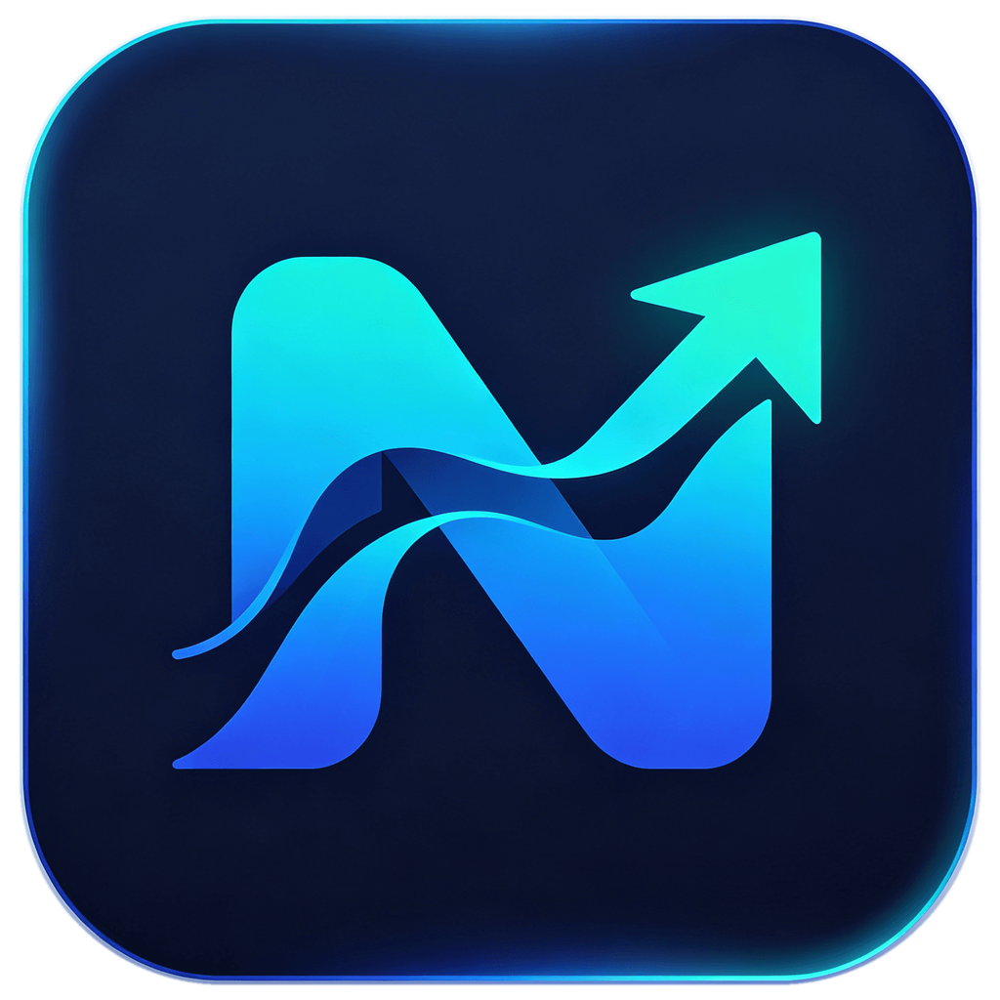
  </p>

  <h1>Navop</h1>

  <p><strong>Native all-in-one workspace for databases, SSH, SFTP, port forwarding, terminals, remote desktop, monitoring, and AI.</strong></p>

  <p>
    Built with <a href="https://gpui.rs">GPUI</a> · Rust native desktop · GPU-accelerated rendering
  </p>

  <p>
    <a href="https://github.com/feigeCode/navop/releases"></a>
    <a href="https://github.com/feigeCode/navop/actions/workflows/ci.yml"></a>
    <a href="#license"></a>
    <a href="https://qm.qq.com/cgi-bin/qm/qr?k=&group_code=860670605"></a>
    <a href="https://docs.qq.com/doc/DVEFFd2RnSnJLcFBD"></a>
  </p>

  <p>
    
    
    
    
    
    
    
    
    
    
    
    
    
    
    
    
    
    
    
    
  </p>

  <p>
    <a href="README_CN.md">中文</a> ·
    <a href="#install">Install</a> ·
    <a href="https://github.com/feigeCode/navop/releases/latest">Latest Release</a> ·
    <a href="#features">Features</a> ·
    <a href="#screenshots">Screenshots</a> ·
    <a href="CONTRIBUTING.md">Contributing</a>
  </p>

  <p>
    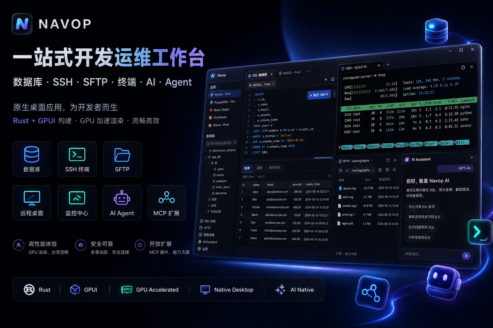
  </p>
</div>

## What's New in v0.9.0

- **Terminal command bar and quick commands** — use command suggestions, persistent shortcuts, pinned commands, and fast access from the terminal or sidebar.
- **Workspace Explorer and Git tools** — browse and manage workspace files, open tabbed editors, review diffs, switch and push branches, and roll back changes without leaving the terminal workspace.
- **Source-safe Markdown editing** — File Explorer and Notes use Navop's native source-preserving Markdown editor. Markdown stays authoritative, rich previews remain editable, and unsupported syntax is preserved for exact source editing.
- **Persistent connection navigation** — filter and open database, SSH, and other resources from the home navigation rail, with quick access to Notes, extensions, settings, and team management.
- **Cross-platform reliability** — Redis binary values are preserved correctly, image-only Markdown table cells can be cleared, and release packaging now covers macOS, Windows, x86_64 Linux, and ARM64 Linux.


## Why Navop?

<table>
  <tr>
    <td width="50%">
      <h3>Native desktop, not a browser shell</h3>
      <p>Navop is built with Rust and GPUI for a native desktop experience with GPU-accelerated rendering.</p>
    </td>
    <td width="50%">
      <h3>One workspace for daily ops</h3>
      <p>Database management, SSH terminals, SFTP file transfer, port forwarding, serial connections, local terminals, and remote desktop (RDP/VNC) live in one app.</p>
    </td>
  </tr>
  <tr>
    <td>
      <h3>AI next to your data</h3>
      <p>Use the built-in AI assistant for natural language to SQL, query explanation, BI-style analysis, and chart generation.</p>
    </td>
    <td>
      <h3>Remote work without context switching</h3>
      <p>Open a remote terminal, browse files through SFTP, drag files into the sidebar, and edit remote files with syntax highlighting.</p>
    </td>
  </tr>
</table>

## Features

### Database Workspace

Connect to MySQL, PostgreSQL, SQLite, DuckDB, SQL Server, Oracle, and ClickHouse from a single interface. Network database connections can route through per-connection SOCKS5 or HTTP CONNECT proxies, including authenticated proxies and SSH tunnels reached through a proxy. Browse schemas, tables, columns, indexes, foreign keys, procedures, functions, triggers, and sequences where supported.

Beyond the built-in drivers, Navop ships an extension marketplace that adds database drivers for Dameng DM, KingbaseES, GBase 8s, OceanBase, openGauss, Apache IoTDB, and a pure-Go Oracle driver that runs without Oracle Instant Client. Install the ones you need and they appear alongside the built-in connections.

### SQL Editor & Schema Tools

Work with a SQL editor backed by syntax tooling, schema-aware browsing, table structure editing, query execution, explain support, and ER diagrams. Database object rows expose context actions, and result tabs keep their scrollbars pinned to the viewport for large or multi-statement result sets. Database compare tools support schema/data comparison, target selection, sync planning, and multi-table synchronization workflows.

### Redis & MongoDB

Use the dedicated Redis viewer for multi-database key browsing, server-side pagination, binary-safe String inspection, and cluster connections. Explore MongoDB collections, inspect documents, run queries, and expose host-authoritative MongoDB tools through Public MCP from the same workspace.

### Notes

The Notes workspace supports local Markdown documents, rich-text/Markdown round trips, Markdown bundles for whiteboards, syntax highlighting, Mermaid diagrams, and math rendering. Its Markdown view handles standard syntax, safely restricted HTML blocks, relative media, and images inside Markdown tables while keeping source editing available; rendering remains bounded for safety and portability rather than acting as a full browser page. Document locations, editor shortcuts, and AI Providers are configurable. Extension-provided renderers can add or update document formats independently, and a sandboxed WASM exporter can produce self-contained HTML, PDF, and Word DOCX files.

### SSH, SFTP, Port Forwarding, Serial & Terminal

Open integrated SSH sessions, manage SFTP files, start port forwarding tunnels, connect to serial devices, and arrange terminals in native draggable split workspaces. Local terminal profiles support the system shell, PowerShell, Command Prompt, WSL, Git Bash, and custom programs with safely parsed arguments; choose a profile when opening a terminal instead of changing the global default first. The terminal AI sidebar works with both SSH and local sessions and uses the active terminal as its default resource context. The terminal also includes grouped quick commands, command history, broadcast input, bounded `terminal.read` diagnostics, and remote shell integration management. The SFTP workspace can switch either side between local storage and searchable remote endpoints, copy files directly between servers, upload by drag-and-drop or paste, and jump through path favorites. Terminal sessions can also paste clipboard images into compatible server-side TUI applications.

### Port Forwarding

Create reusable SSH port forwarding connections from existing SSH/SFTP servers. Navop supports local forwarding for services such as databases or internal HTTP endpoints, plus dynamic SOCKS tunnels for routing tools through a remote host.

### Remote File Editing

Edit remote files directly inside Navop with syntax highlighting and autocomplete. No need to open another editor or switch back and forth between terminal and file tools.

### Remote Desktop (RDP & VNC)

Open RDP and VNC sessions through installable remote desktop providers. Each connection can use a SOCKS5 or HTTP CONNECT proxy without requiring a provider protocol upgrade. Incremental frame streaming reduces full-frame work and keeps active sessions more responsive, while stalled VNC sessions can recover more reliably. Connect to Windows machines over RDP, or to any VNC server, and drive the remote desktop from the same workspace where your databases, terminals, and files live.

### Monitoring & Charts

Use built-in server monitoring and native rendered charts to inspect remote machine status and data analysis output.

### AI Assistant

Chat with AI inside the app. Navop supports natural language to SQL, query explanation, BI-style data analysis, chart generation, streaming LLM responses, AI Agent workflows, and Function Calling for tool-based task execution. Navop also supports ACP (Agent Client Protocol), allowing external AI agents to connect through extensions; ACP extensions are currently available for Codex, Claude Code, and OpenCode. HTML code blocks can be opened in the browser or previewed in an in-app dialog, and generated terminal commands can be quickly pasted into a terminal session and run.

### Public MCP, Navop CLI, and Agent Skill

Navop includes an authenticated Public MCP runtime for external Codex, Claude, MCP clients, and automation. Enable it under **Settings > General > MCP > MCP Server**, select a permission profile, and expose only the tool groups you want under **Settings > General > Tool Exposure**.

The runtime binds to a dynamic loopback-only port and requires the 64-character token stored in Navop's user-only discovery file. Navop remains the only tool implementation, security, permission, approval, connection/session, and audit boundary. The built-in Agent continues to call the internal Rust ToolRegistry directly; it does not reconnect to Navop through npm.

External MCP clients use the separately published [`@navop/mcp`](https://github.com/feigeCode/navop-mcp) stdio bridge. AI Agents use the separately published [`@navop/cli`](https://github.com/feigeCode/navop-mcp) package and its bundled Skill:

```bash
npm install -g @navop/cli@latest
navop status --json
navop tools --json
navop schema <tool-name> --json
navop call <tool-name> --arguments '<json-object>' --json
npx -y @navop/mcp@latest
```

The Navop Skill gives an AI Agent a lower-context terminal workflow instead of registering the complete Navop tool catalog as native MCP tools in every turn. It uses `navop status`, `navop db query`, `navop ssh exec`, or the live `tool schema/call` interface. The Agent loads the compact Skill, then discovers a command or schema only when the task needs it. This avoids repeatedly placing a large set of tool names, descriptions, and JSON schemas into model context and can reduce repeated context and Token overhead when many tools are exposed.

The Skill and CLI do not bypass or replace the Navop host runtime. CLI commands still connect to the authenticated loopback Public MCP endpoint internally, and the running Navop application remains authoritative for tools, schemas, resource ids, Tool Exposure, permissions, approvals, sessions, results, and auditing.

| Agent integration | Context behavior | Best fit |
| --- | --- | --- |
| Native MCP tools | The client may advertise many enabled Navop tools and schemas to the model on each turn. | Clients that prefer direct structured tool calling and can manage the larger tool context. |
| Navop Skill + terminal CLI | The Agent keeps a compact Skill and discovers status, commands, and schemas on demand before running `navop ... --json`. | Codex and terminal-capable AI Agents that want broad Navop access with a smaller recurring context and lower token overhead. |

The npm packages version the shared client, CLI/Skill, and stdio bridge, not Navop's host tool registry. Tool names, descriptions, schemas, annotations, Tool Exposure groups, permission mode, sessions, and results come from the running Navop host through MCP `initialize`, `tools/list`, `tools/call`, and the read-only `navop.runtime_status` tool. Navop can therefore add or update host tools without requiring a synchronized npm release.

Current Public MCP capability groups include:

| Group | Current host capabilities |
| --- | --- |
| Runtime | compatibility metadata, permission guidance, Tool Exposure group states, live tools and schemas |
| SSH | isolated command execution, session diagnostics, background command poll/output/cancel |
| Visible terminal | bounded output reading, visible PTY execution, explicit interruption |
| SQL databases | schema, tables, descriptions, sample rows, read-only query, write-capable execution |
| Redis | active connections, command, keys, get, set |
| MongoDB | databases, collections, find, aggregate, count, indexes, validation, CRUD, explain |
| SFTP | list, stat, read, write, upload, download |
| Connections | list, find, show, kinds, schema, validate, save, delete, test, open, sessions |
| Workspaces | list and show |
| Internal functions | list registered host functions and call them through their live schemas |

Availability is always determined at runtime. A group disabled in Tool Exposure is not advertised as available, and connection/session-specific operations require a real resource id returned by Navop. Callers must not guess ids or bypass permission and approval decisions.

Navop permission profiles map to Public MCP behavior:

| Profile | Behavior |
| --- | --- |
| Safe / `deny` | read-only discovery is available; mutations are denied |
| Confirm / `ask` | mutations require approval in the Navop UI |
| Auto / `allow` | mutations run automatically; destructive intent must still be explicit |

Navop can install and inspect Codex and Claude Code MCP configurations, copy a generic MCP JSON configuration, and install/update the bundled `navop` Skill for Codex or Agents-compatible clients. The Skill does not embed a static tool manual or preload every tool schema. It teaches Agents to use `navop`, begin with `status --json`, inspect only the required command or live schema, and then operate the selected Navop resource.

```bash
npm install -g @navop/cli@latest
navop skill install --target codex --scope user
navop skill install --target agents --scope user
navop status --json
navop db query --help
navop tool schema <tool-name> --json
navop tool call <tool-name> --arguments '<json-object>' --json
npm view @navop/cli version
navop --version
```

The baseline documentation uses `@latest` for the install/update source. The CLI must be installed globally before an Agent runs `navop` commands:

```bash
npm install -g @navop/cli@latest
navop status --json
```

Representative read-only terminal workflows follow the same pattern. First discover the current connection or session identifiers; then inspect the live help or schema before running the operation:

```bash
navop connections sessions --json
navop ssh exec --target <ssh-session-id> --command 'uname -a' --json
navop sftp list --connection <ssh-connection-id-or-name> --path /var/log --json
navop redis get --connection-id <redis-connection-id-or-name> --key app:status --json
navop mongo find --connection-id <mongo-session-id> --database app --collection users --filter '{"active":true}' --limit 20 --json
navop db query --connection <database-connection-id-or-name> --sql 'SELECT 1' --json
navop terminal read --target <terminal-session-id> --lines 80 --json
```

### Performance & Rendering

Navop uses native GPUI rendering and continues to tune heavy UI paths. Recent releases fixed font fallback/rendering issues that could cause garbled text, and reduced render-process blocking that could make connection lists and data lists stutter while scrolling.

### Sync, Security & i18n

Sync connections and settings across devices with encrypted key storage based on AES-GCM and Ed25519. Navop supports light and dark themes, English, Simplified Chinese, and Traditional Chinese.

## Screenshots

| Database | SSH |
|:-:|:-:|
| [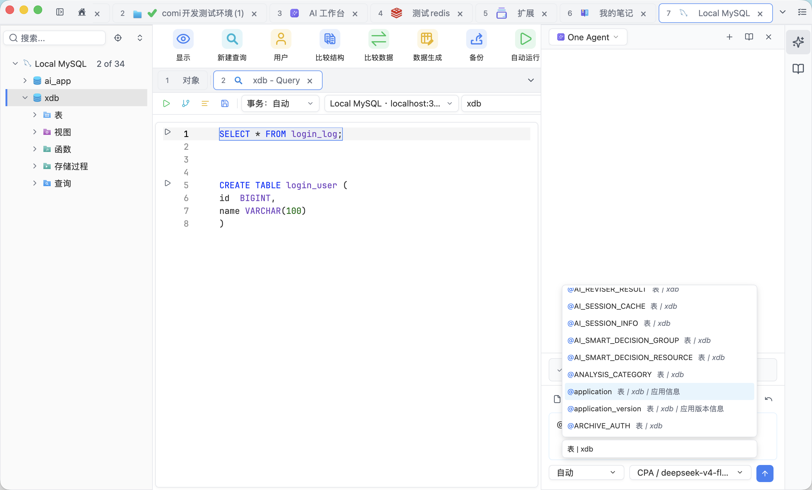](database.png) | [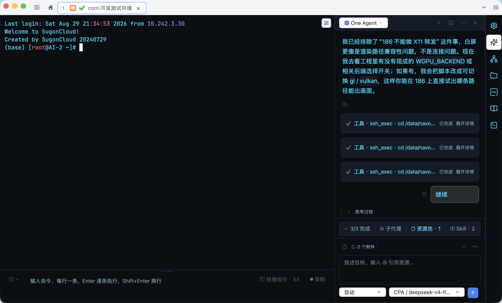](ssh.png) |

| SFTP | Redis |
|:-:|:-:|
| [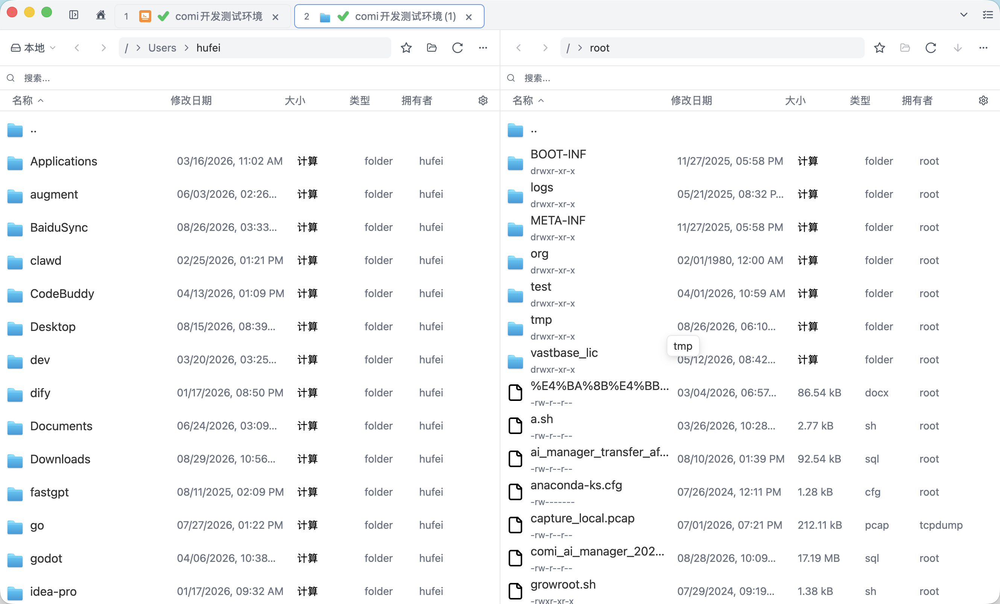](sftp.png) | [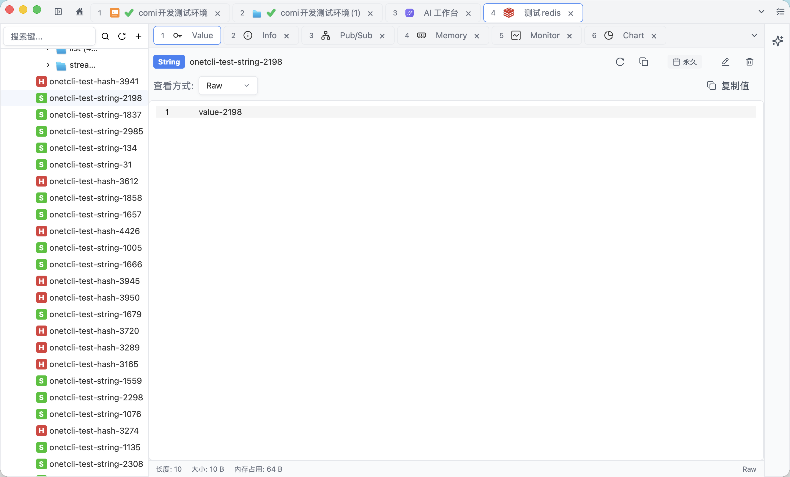](redis.png) |

| MongoDB | AI Chat |
|:-:|:-:|
| [](mongodb.png) | [](chatdb.png) |

| Monitoring | SFTP Sidebar |
|:-:|:-:|
| [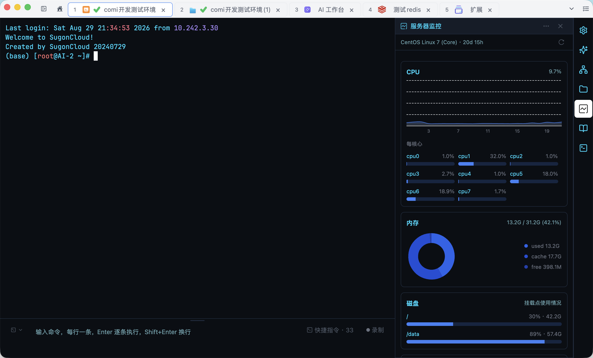](monitor.png) | [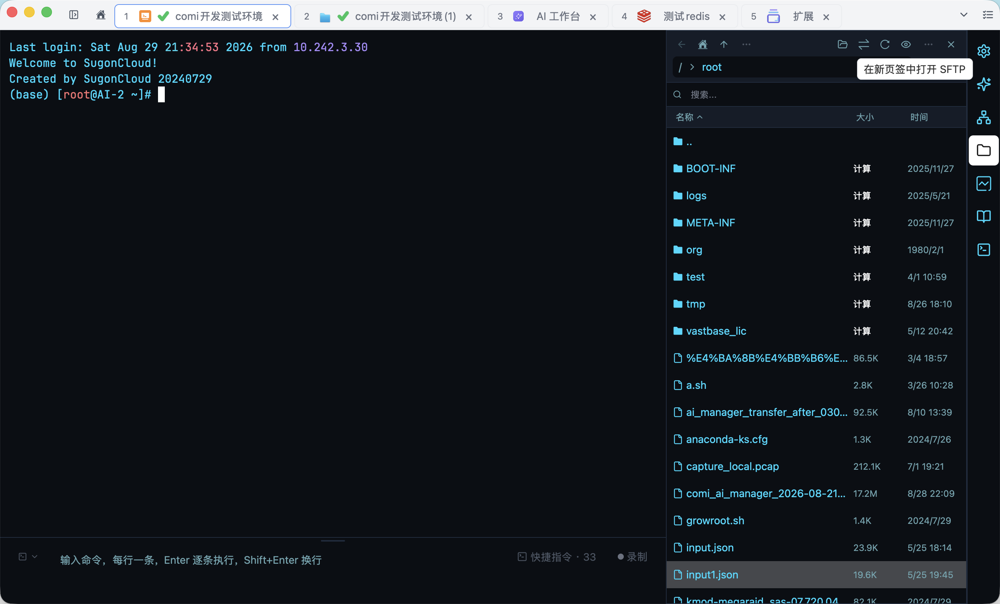](sftp_sidebar.png) |

| Remote File Editor | ER Diagram |
|:-:|:-:|
| [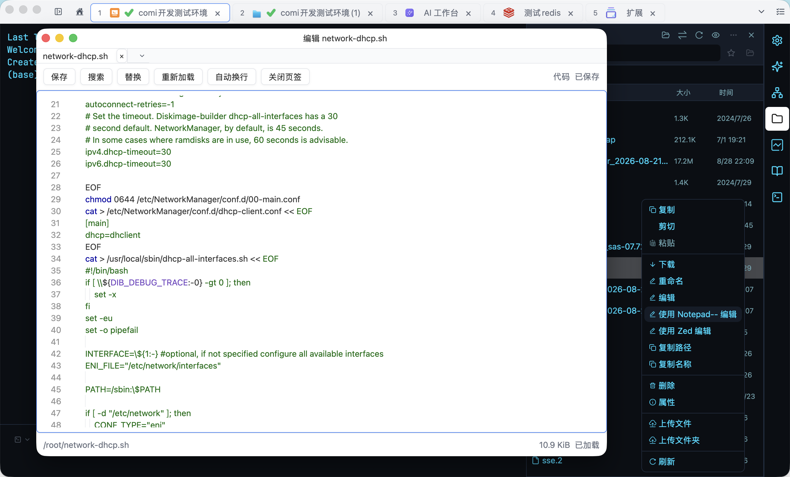](remote_file_editor.png) | [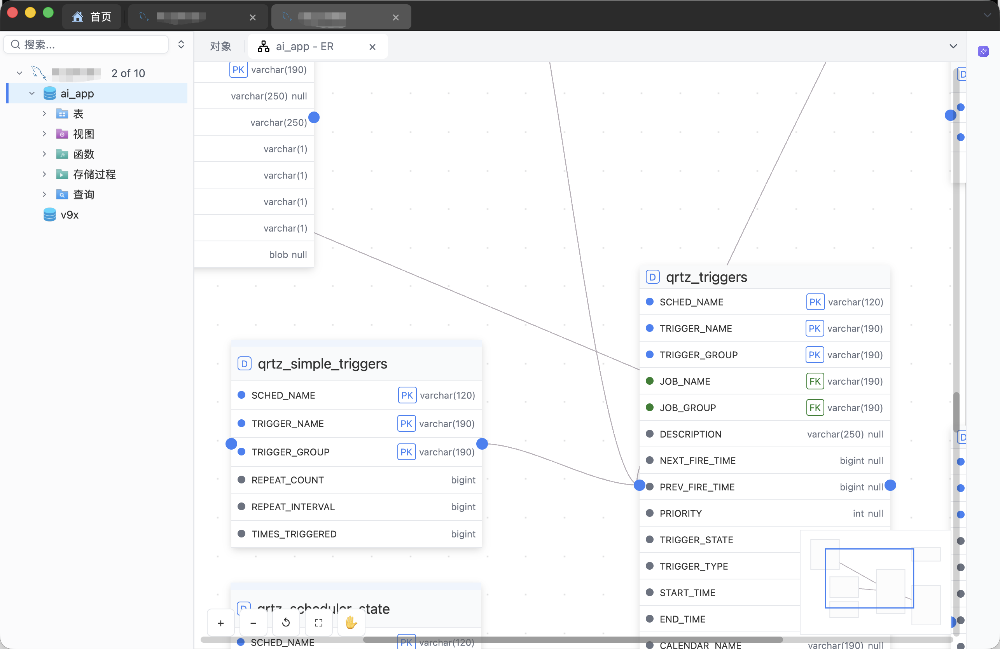](er.png) |

| Extensions |
|:-:|
| [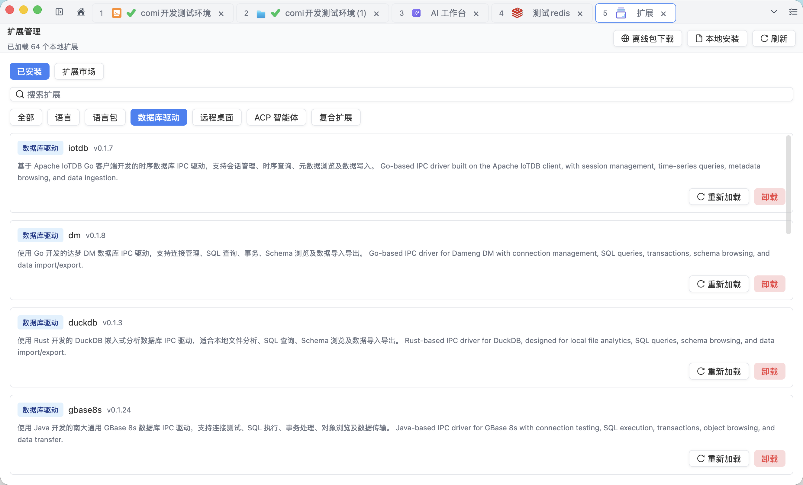](extension.png) |

| Markdown Notes | Rich-text Notes |
|:-:|:-:|
| [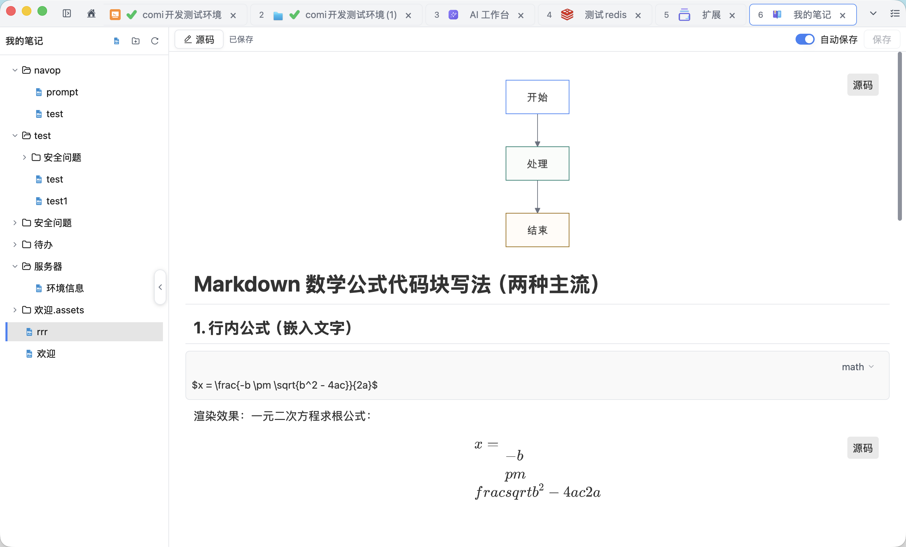](markdown.png) | [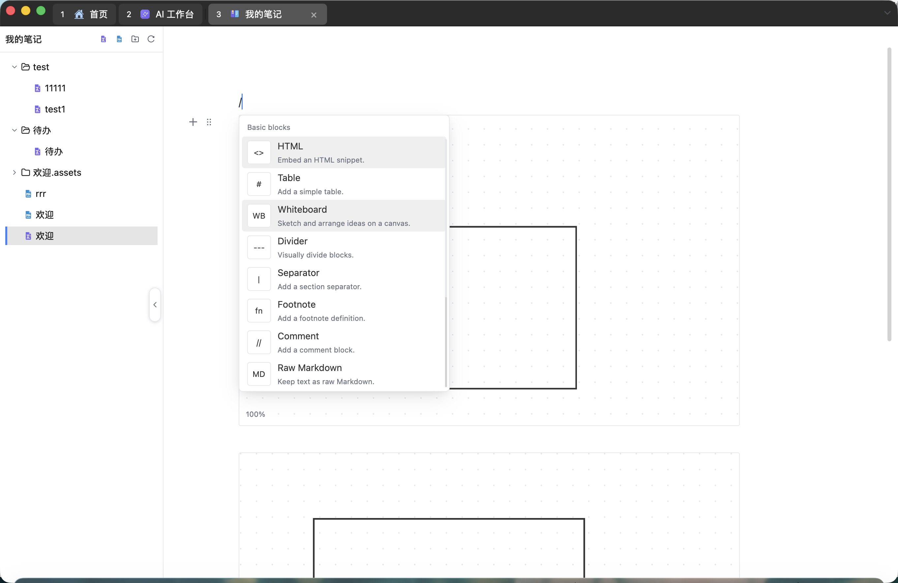](richtext.png) |

The Markdown workspace renders standard Markdown syntax, safely restricted HTML blocks, and images inside Markdown tables, while keeping source editing available.

| Whiteboard Notes |
|:-:|
| [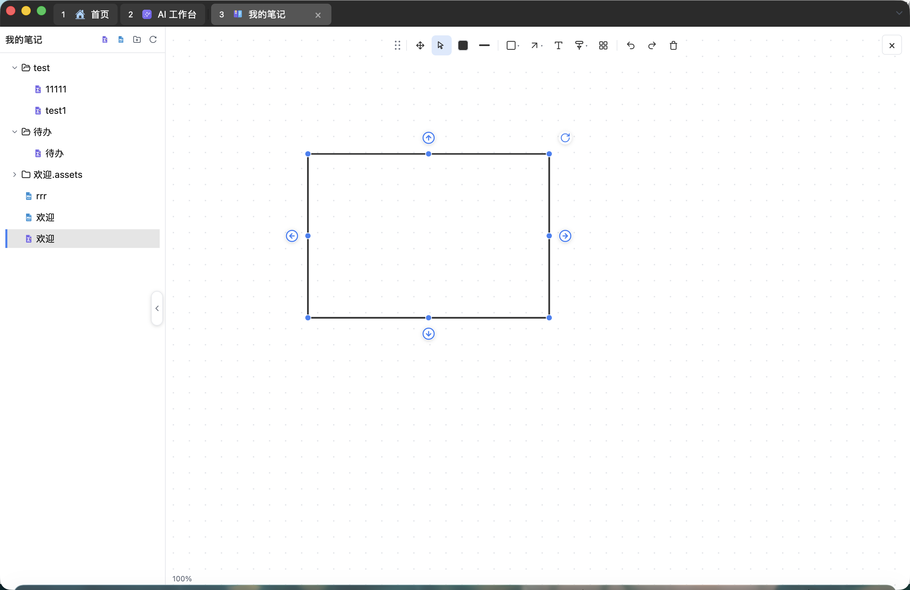](whiteboard.png) |

## Install

Download the latest build from the [Releases](https://github.com/feigeCode/navop/releases/latest) page.

Release artifacts are currently published by platform:

| Platform | Architecture | Artifact |
|----------|--------------|----------|
| macOS | Apple Silicon, Intel | `.dmg`, `.tar.gz` |
| Linux | x86_64 | `.tar.gz`, `.deb`, `.rpm`, `.AppImage` |
| Linux | ARM64 | `.tar.gz` |
| Windows | x86_64 | `.msi`, `.zip` |

Checksums are published as `sha256sums.txt` in each release.

On Windows, use `navop-x86_64-pc-windows-msvc.msi` for a bilingual English/Chinese per-user installer. It defaults to `%LOCALAPPDATA%\Programs\Navop` and appends the `Navop` subdirectory when you choose another writable parent directory. It also creates desktop and Start menu shortcuts; administrator privileges are not required for the default location. The `.zip` archive remains available for portable use and in-app updates.

### macOS Gatekeeper

If macOS blocks the app after installing the DMG with "Apple cannot check it for malicious software", run:

```bash
sudo xattr -rd com.apple.quarantine /Applications/Navop.app
```

### Oracle Support

The built-in Oracle driver requires [Oracle Instant Client](https://www.oracle.com/database/technologies/instant-client/downloads.html) (Basic package). Download the version matching your platform and ensure the libraries are in your library search path. Alternatively, install the pure-Go Oracle driver from the extension marketplace, which has no Instant Client dependency.

## Getting Started

1. Open Navop and create your first database connection.
2. Add an SSH host and open a remote terminal.
3. Create a port forwarding connection from that SSH host when you need a local tunnel or SOCKS proxy.
4. Open SFTP file management to browse remote directories or transfer files.
5. Try Redis key browsing or MongoDB document browsing.
6. Use the AI assistant in SQL or data analysis workflows.

## Build From Source

### Prerequisites

- Rust 2024 edition
- Platform-specific system dependencies

### System Dependencies

**macOS / Linux:**

```bash
./script/bootstrap
```

**Windows (PowerShell):**

```powershell
.\script\install-window.ps1
```

### Run

```bash
cargo run -p main
```

### Development Checks

```bash
# Build
cargo build

# Test
cargo test --all

# Lint
cargo clippy --workspace --all-targets

# Format check
cargo fmt --check
```

See [CONTRIBUTING.md](CONTRIBUTING.md) for the full development guide.

## Tech Stack

| Category | Technologies |
|----------|--------------|
| UI Framework | [GPUI](https://gpui.rs) |
| Language | Rust |
| Databases | tokio-postgres, mysql_async, rusqlite, tiberius, oracle, clickhouse, duckdb |
| Database extensions | Dameng DM, KingbaseES, GBase 8s, OceanBase, openGauss, Apache IoTDB, pure-Go Oracle |
| Redis / MongoDB | redis, mongodb |
| SSH / SFTP / Port Forwarding | russh, russh-sftp, SOCKS5 over SSH direct-tcpip |
| Remote Desktop | RDP & VNC providers via extension runtime |
| Terminal | alacritty_terminal |
| Text Editing | ropey, tree-sitter, sqlparser |
| AI | llm-connector |
| Encryption | aes-gcm, sha2, ed25519 |
| i18n | rust-i18n |

## FAQ

<details>
<summary><strong>Which databases are supported?</strong></summary>

Navop has built-in database support for MySQL, PostgreSQL, SQLite, DuckDB, SQL Server, Oracle, and ClickHouse, plus dedicated Redis and MongoDB views. The extension marketplace adds Dameng DM, KingbaseES, GBase 8s, OceanBase, openGauss, Apache IoTDB, and a pure-Go Oracle driver, so domestic and specialty databases are covered alongside the mainstream ones.
</details>

<details>
<summary><strong>Does Oracle need extra setup?</strong></summary>

Yes. The built-in Oracle driver requires Oracle Instant Client to be installed and available through your system library search path. You can also install the pure-Go Oracle driver from the extension marketplace, which runs without Instant Client.
</details>

<details>
<summary><strong>Where can I download Navop?</strong></summary>

Use the GitHub [Releases](https://github.com/feigeCode/navop/releases/latest) page. The current release workflow publishes macOS, Linux, and Windows artifacts with checksums.
</details>

<details>
<summary><strong>Is Navop free?</strong></summary>

All features are available without sponsorship. Navop-authored source is licensed under Apache License 2.0 and the Navop Supplementary License. Distributions must comply with all applicable third-party license terms.
</details>

<details>
<summary><strong>How do I report bugs or request features?</strong></summary>

Open an issue on [GitHub Issues](https://github.com/feigeCode/navop/issues). For code changes, please read [CONTRIBUTING.md](CONTRIBUTING.md) first.
</details>

## Support

Navop is maintained by one person over the long term. If it saves you time, you can support the project through donations, stars, bug reports, or focused pull requests.

### Donation

Donation is optional and does not unlock or restrict any features. See [DONATE.md](DONATE.md) for WeChat Pay, Alipay, and PayPal options.

### Community Contacts

Official community channels:

- QQ Group: [860670605](https://qm.qq.com/cgi-bin/qm/qr?k=&group_code=860670605)
- WeChat Group: [Join](https://docs.qq.com/doc/DVEFFd2RnSnJLcFBD)

## Credits

ER diagram rendering is based on [ferrum-flow](https://github.com/tu6ge/ferrum-flow.git).

## License

Navop source code is licensed under [Apache License 2.0](LICENSE-APACHE).

Navop-authored portions are additionally subject to the [Navop Supplementary License](NAVOP_LICENSE), which adds the following restrictions on top of Apache 2.0. These supplementary terms do not replace or limit licenses that apply to third-party components:

- No redistribution, resale, or repackaging as a standalone product
- No creating competing products or services based on this software
- No hosting on unauthorized distribution platforms

For licensing inquiries, contact xiaofei.hf@gmail.com.

## Star History

<a href="https://www.star-history.com/?repos=feigeCode%2Fnavop&type=date&logscale=&legend=top-left">
 <picture>
   <source media="(prefers-color-scheme: dark)" srcset="https://api.star-history.com/chart?repos=feigeCode/navop&type=date&theme=dark&logscale&legend=top-left" />
   <source media="(prefers-color-scheme: light)" srcset="https://api.star-history.com/chart?repos=feigeCode/navop&type=date&logscale&legend=top-left" />
   
 </picture>
</a>
