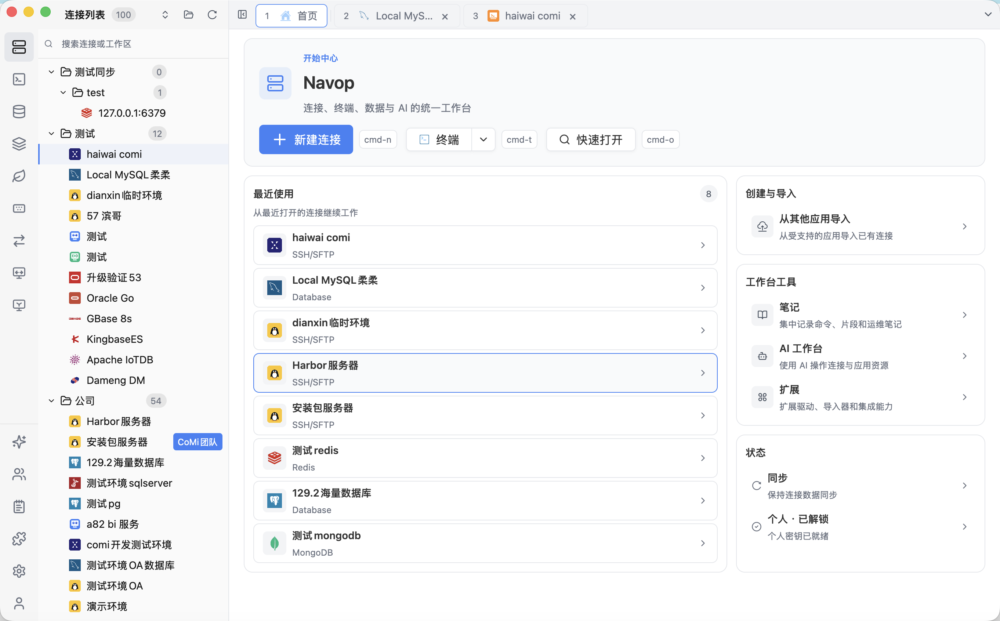
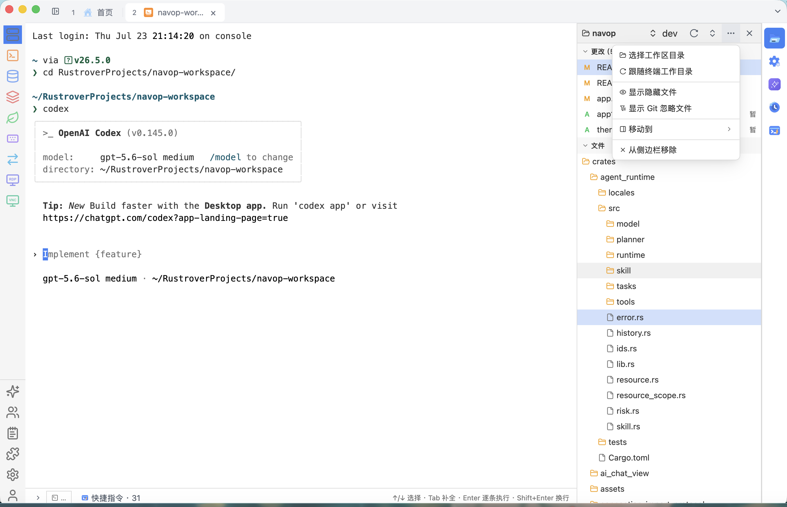
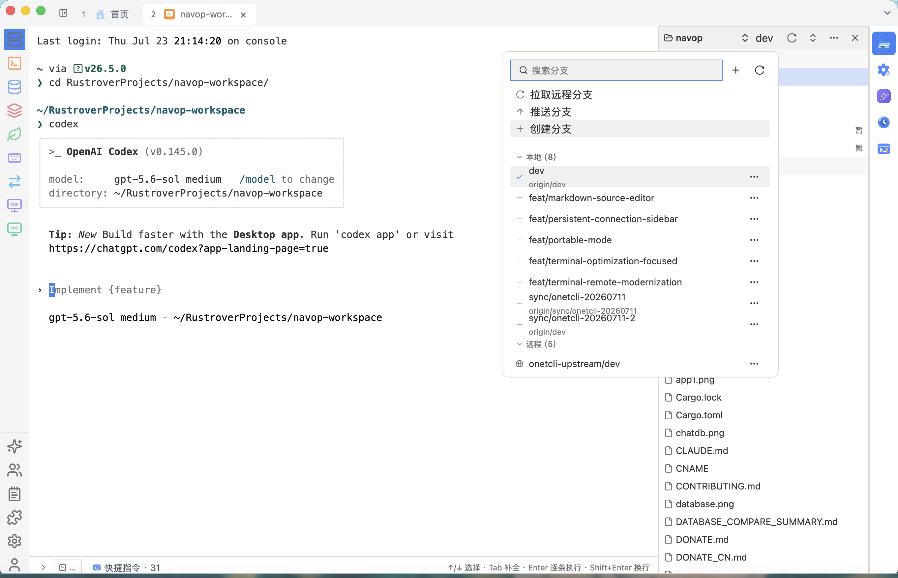
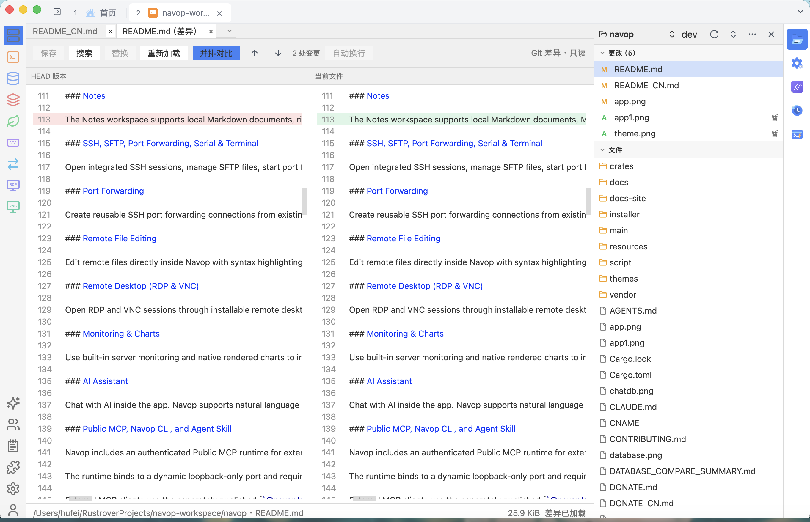
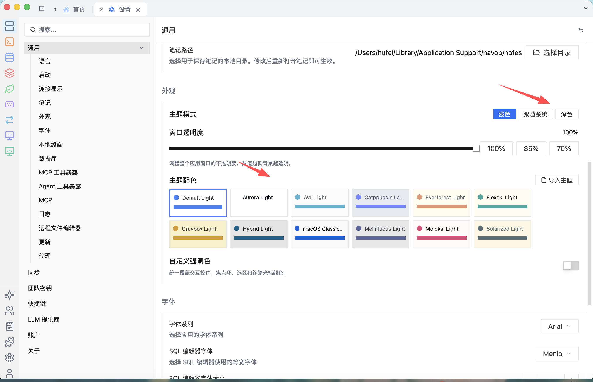

> 老仓库 ：<https://github.com/feigeCode/onetcli> · [](https://github.com/feigeCode/onetcli)

<div align="center">
  <p>
    
  </p>

  <h1>Navop</h1>

  <p><strong>数据库、SSH、SFTP、端口转发、终端、远程桌面、监控与 AI 一体化的原生桌面工作台。</strong></p>

  <p>
    基于 <a href="https://gpui.rs">GPUI</a> 构建 · Rust 原生桌面应用 · GPU 加速渲染
  </p>

  <p>
    <a href="https://github.com/feigeCode/navop/releases"></a>
    <a href="https://github.com/feigeCode/navop/actions/workflows/ci.yml"></a>
    <a href="#许可证"></a>
    <a href="https://qm.qq.com/cgi-bin/qm/qr?k=&group_code=860670605"></a>
    <a href="https://docs.qq.com/doc/DVEFFd2RnSnJLcFBD"></a>
  </p>

  <p>
    
    
    
    
    
    
    
    
    
    
    
    
    
    
    
    
    
    
    
    
  </p>

  <p>
    <a href="README.md">English</a> ·
    <a href="#安装">安装</a> ·
    <a href="https://github.com/feigeCode/navop/releases/latest">最新版本</a> ·
    <a href="#功能特性">功能特性</a> ·
    <a href="#应用截图">应用截图</a> ·
    <a href="CONTRIBUTING.md">参与贡献</a>
  </p>

  <p>
    
  </p>
</div>

## v0.9.1 更新亮点

- **更安全的 Markdown 工作流** — Markdown 默认以只读预览打开，需要修改时切换到源码模式，避免预览切换意外改写原始内容。
- **统一主题系统** — 应用与终端共享更完整的主题配色、外观设置和主题导入能力，统一输入框、弹层、滚动条、终端与 Markdown 的视觉风格。
- **更高效的连接导航** — 首页升级为最近连接仪表盘；常驻侧栏新增虚拟化列表、显示切换、拖拽、分组、复制分享和灵活宽度调整。
- **便携与远程工作增强** — 新增便携运行模式、带操作系统图标识别的 SSH X11 转发，以及独立远程桌面窗口全屏。
- **数据库与界面稳定性** — 修复受限 MongoDB 账号、PostgreSQL 数值精度与 SQLSTATE、查询标签隔离、页签宽度、终端命令栏、RDP 重连和跨平台布局等问题。


## 为什么选择 Navop？

<table>
  <tr>
    <td width="50%">
      <h3>原生桌面体验，而不是浏览器外壳</h3>
      <p>Navop 使用 Rust 和 GPUI 构建，提供原生桌面体验与 GPU 加速渲染。</p>
    </td>
    <td width="50%">
      <h3>日常运维集中到一个工作区</h3>
      <p>数据库管理、SSH 终端、SFTP 文件传输、端口转发、串口连接、本地终端以及远程桌面（RDP/VNC）都在同一个应用中完成。</p>
    </td>
  </tr>
  <tr>
    <td>
      <h3>AI 就在数据旁边</h3>
      <p>内置 AI 助手支持自然语言生成 SQL、查询解释、BI 数据分析和图表生成。</p>
    </td>
    <td>
      <h3>远程工作少切换上下文</h3>
      <p>打开远程终端，通过 SFTP 浏览文件，把文件拖进侧边栏上传，并直接编辑带语法高亮的远程文件。</p>
    </td>
  </tr>
</table>

## 功能特性

### 数据库工作区

在同一界面连接 MySQL、PostgreSQL、SQLite、DuckDB、SQL Server、Oracle 和 ClickHouse。网络数据库连接支持每连接 SOCKS5 / HTTP CONNECT 代理、代理认证，以及“通过代理连接 SSH 再建立数据库隧道”。可浏览数据库、Schema、表、字段、索引、外键、过程、函数、触发器和序列等对象，具体能力取决于数据库类型。

在内置驱动之外，Navop 还提供扩展市场，可按需安装达梦 DM、金仓 KingbaseES、南大通用 GBase 8s、OceanBase、openGauss、Apache IoTDB 的数据库驱动，以及一个无需 Oracle Instant Client 的纯 Go Oracle 驱动。安装后会与内置数据库一同出现在连接列表中。

### SQL 编辑器与 Schema 工具

提供 SQL 编辑、语法相关能力、Schema 浏览、表结构编辑、查询执行、Explain 支持与 ER 图等数据库工作流。数据库对象行提供上下文操作，大结果集或多语句结果页签会把滚动条稳定固定在可视区域。数据库比较工具支持 schema/data 比较、目标选择、同步计划和多表同步流程。

### Redis 与 MongoDB

专用 Redis 视图支持多数据库 Key 浏览、服务端分页、二进制安全的 String 查看与集群连接。MongoDB 视图支持集合浏览、文档查看、查询，以及通过 Public MCP 暴露由 Navop 宿主权威定义的 MongoDB 工具。

### Notes 笔记

Notes 工作区支持本地 Markdown 文档、白板 Markdown bundle、语法高亮、Mermaid 和数学公式渲染。Markdown 文档视图支持标准语法、受限 HTML 安全渲染、相对媒体资源和 Markdown 表格内图片展示，并保留源码编辑入口；渲染以安全与可移植性为边界，不等同于完整浏览器页面。文档位置、编辑器快捷键和 AI Provider 均可配置；渲染能力还可以通过扩展提供和更新，沙箱化 WASM 导出器还可生成自包含 HTML、PDF 和 Word DOCX 文件。

### SSH、SFTP、端口转发、串口与终端

集成 SSH 会话、SFTP 文件管理、端口转发、串口连接和本地终端，并可在原生可拖拽分屏工作区中排列终端。本地终端可选择系统默认、PowerShell、CMD、WSL、Git Bash，或配置自定义程序与安全解析的启动参数；打开终端时即可选择 Profile，无需先修改全局默认值。终端 AI 侧边栏同时支持 SSH 与本地会话，并以当前终端作为默认资源上下文。终端还支持快捷命令分组、命令历史、广播输入、有界 `terminal.read` 诊断和远程 shell integration 管理。SFTP 工作区可将左右两侧切换为本地存储或可搜索的远程端点，在服务器之间直接复制文件，也支持拖拽/粘贴上传和路径收藏。终端会话还支持粘贴剪贴板图片，并将图片传递给兼容的服务器端 TUI 应用。

### Agent Hub

Agent Hub 将终端 Agent、工作区资源管理器、Git 更改列表、分支操作和并排 Diff 组合成一套完整的编码工作区。整体交互采用市面上成熟 Agent 编程工具中用户熟悉的布局，同时保留 Navop 的本地/SSH 终端、连接上下文和运维资源。工作区可跟随终端目录，并支持检查生成文件、搜索或切换分支、拉取与推送，以及在提交前逐项复核 Agent 修改。

### 端口转发

基于已有 SSH/SFTP 服务器创建可复用的 SSH 端口转发连接。Navop 支持用于数据库、内部 HTTP 服务等场景的本地端口转发，也支持动态 SOCKS 隧道，方便把本地工具流量经远程主机转发。

### 远程文件编辑

可直接在 Navop 内编辑远程文件，支持语法高亮和自动补全。无需额外打开其他编辑器，也无需在终端和文件工具之间来回切换。

### 远程桌面（RDP 与 VNC）

通过可安装的远程桌面 provider 打开 RDP 和 VNC 会话。每个连接都可使用 SOCKS5 或 HTTP CONNECT 代理，无需升级 provider 协议。增量帧传输减少整帧处理，让活跃会话响应更及时，并提高 VNC 卡住后的恢复可靠性。可经 RDP 连接 Windows 机器，或连接任意 VNC 服务端，在数据库、终端和文件所在的同一个工作台里直接操作远程桌面。

### 监控与图表

内置简易服务器监控和原生渲染图表，可查看远程机器状态，也可用于数据分析结果展示。

### AI 助手

应用内直接与 AI 对话，支持自然语言生成 SQL、查询解释、BI 数据分析、图表生成、流式 LLM 响应、AI Agent 工作流，以及通过 Function Calling 调用工具完成任务。Navop 同时支持 ACP（Agent Client Protocol），可通过扩展接入不同的外部 AI Agent；目前提供 Codex、Claude Code 和 OpenCode 的 ACP 扩展。HTML 代码块可在浏览器中打开，也可通过应用内弹窗预览；AI 生成的终端命令可快速粘贴到终端会话中执行。

### Public MCP、Navop CLI 与 Agent Skill

Navop 内置经过认证的 Public MCP runtime，可供外部 Codex、Claude、MCP 客户端与自动化程序使用。请在 **设置 > 通用 > MCP > MCP Server** 中开启服务、选择权限档位，并在 **设置 > 通用 > Tool Exposure** 中只开放实际需要的工具组。

runtime 只监听动态 loopback 端口，客户端必须使用 Navop 写入 user-only discovery 文件的 64 位十六进制 token 完成握手。Navop 始终是工具实现、安全、权限、审批、连接/会话与审计的唯一边界。内置 Agent 继续直接调用 Rust 内部 ToolRegistry，不会通过 npm 回连自身。

外部客户端通过独立发布的 [`@navop/mcp`](https://github.com/feigeCode/navop-mcp) 使用轻量 stdio bridge、宿主驱动 CLI 与可安装 Agent Skill：

```bash
npx -y @navop/mcp@0.1.2 status --json
npx -y @navop/mcp@0.1.2 tools --json
npx -y @navop/mcp@0.1.2 schema <tool-name> --json
npx -y @navop/mcp@0.1.2 call <tool-name> --arguments '<json-object>' --json
npx -y @navop/mcp@0.1.2 mcp
```

npm 版本表示外部客户端、CLI、Skill 与 stdio launcher 的版本，不是 Navop 宿主工具 registry 的版本。工具名、描述、Schema、annotations、Tool Exposure 工具组、权限模式、会话和调用结果都来自运行中的 Navop 宿主，来源包括 MCP `initialize`、`tools/list`、`tools/call` 与只读工具 `navop.runtime_status`。因此 Navop 可以新增或更新宿主工具，而不要求 npm 包同步发版。

当前 Public MCP 能力组包括：

| 工具组 | 当前宿主能力 |
| --- | --- |
| Runtime | 兼容元数据、权限指引、Tool Exposure 工具组状态、实时工具与 Schema |
| SSH | 隔离命令执行、会话诊断、后台命令轮询/输出/取消 |
| 可见终端 | 有界输出读取、可见 PTY 执行、明确中断 |
| SQL 数据库 | Schema、表、表结构、样例行、只读查询、可写执行 |
| Redis | 活动连接、命令、Keys、Get、Set |
| MongoDB | 数据库、集合、Find、Aggregate、Count、索引、校验规则、CRUD、Explain |
| SFTP | List、Stat、Read、Write、Upload、Download |
| 连接管理 | List、Find、Show、Kinds、Schema、Validate、Save、Delete、Test、Open、Sessions |
| 工作区 | List 与 Show |
| 内部函数 | 列出宿主注册函数，并按实时 Schema 调用 |

实际可用性始终以运行时为准。Tool Exposure 中关闭的工具组不会被描述为可用；依赖连接或会话的操作必须使用 Navop 实际返回的资源 id。调用方不得猜测 id，也不得绕过权限或审批决定。

Navop 权限档位对应 Public MCP 行为：

| 权限档位 | 行为 |
| --- | --- |
| 安全 / `deny` | 允许只读发现；拒绝写操作 |
| 确认 / `ask` | 写操作需要在 Navop UI 中审批 |
| 自动 / `allow` | 写操作自动执行，但破坏性操作仍必须有明确用户意图 |

Navop 可以安装并检查使用精确 npm 版本的 Codex 与 Claude Code MCP 配置、复制通用 MCP JSON 配置，并为 Codex 或兼容 Agents 的客户端安装/更新 `navop` Skill。Skill 不内置静态工具手册，而是要求 Agent 通过 `navop status`、`tools/list` 与实时工具 Schema 获取当前可用方法。

### 性能与渲染

Navop 基于 GPUI 原生渲染，并持续优化高负载 UI 路径。近期已修复字体 fallback / 字体渲染导致的乱码问题，并优化渲染进程阻塞导致的连接列表、数据列表滚动卡顿。

### 同步、安全与国际化

支持跨设备同步连接和设置，密钥使用 AES-GCM 与 Ed25519 加密存储。支持亮色、深色与跟随系统模式，可导入应用和终端主题，并配置强调色与窗口透明度；界面语言包括 English、简体中文、繁体中文。

## 应用截图

| 最近连接仪表盘 | 常驻连接侧边栏 |
|:-:|:-:|
| [](app1.png) | [](app.png) |

| Agent Hub 工作区 | Agent Hub 分支管理 | Agent Hub 差异审核 |
|:-:|:-:|:-:|
| [](agent_hub.png) | [](git_branch.png) | [](git_diff.png) |

| 统一主题 |
|:-:|
| [](theme.png) |

| 数据库 | SSH |
|:-:|:-:|
| [](database.png) | [](ssh.png) |

| SFTP | Redis |
|:-:|:-:|
| [](sftp.png) | [](redis.png) |

| MongoDB | AI 对话 |
|:-:|:-:|
| [](mongodb.png) | [](chatdb.png) |

| 服务器监控 | SFTP 侧边栏 |
|:-:|:-:|
| [](monitor.png) | [](sftp_sidebar.png) |

| 远程文件编辑 | ER 图 |
|:-:|:-:|
| [](remote_file_editor.png) | [](er.png) |

| 扩展市场 |
|:-:|
| [](extension.png) |

| 白板笔记 |
|:-:|
| [](whiteboard.png) |

## 安装

请从 [Releases](https://github.com/feigeCode/navop/releases/latest) 页面下载最新版本。

当前发布产物按平台提供：

| 平台 | 架构 | 产物 |
|------|------|------|
| macOS | Apple Silicon、Intel | `.dmg`、`.tar.gz` |
| Linux | x86_64 | `.tar.gz`、`.deb`、`.rpm`、`.AppImage` |
| Linux | ARM64 | `.tar.gz` |
| Windows | x86_64 | `.msi`、`.zip` |

每个版本会同时发布 `sha256sums.txt` 校验文件。

Windows 使用一个中英双语的 `navop-x86_64-pc-windows-msvc.msi` 进行当前用户安装。安装程序默认使用 `%LOCALAPPDATA%\Programs\Navop`；选择其他可写父目录时，会自动追加 `Navop` 子目录。安装程序同时创建桌面和开始菜单快捷方式，使用默认目录无需管理员权限。`.zip` 继续用于便携运行和应用内自动更新。

### macOS Gatekeeper

如果 macOS 安装 DMG 后提示无法打开（"Apple 无法检查其是否包含恶意软件"），请执行：

```bash
sudo xattr -rd com.apple.quarantine /Applications/Navop.app
```

### Oracle 支持

内置 Oracle 驱动需要安装 [Oracle Instant Client](https://www.oracle.com/database/technologies/instant-client/downloads.html)（Basic 包），请下载与平台匹配的版本并确保库文件位于系统库搜索路径中。如果不想依赖 Instant Client，可从扩展市场安装纯 Go 版 Oracle 驱动。

## 快速开始

1. 打开 Navop，创建第一个数据库连接。
2. 添加 SSH 主机并打开远程终端。
3. 基于该 SSH 主机创建端口转发连接，用于本地隧道或 SOCKS 代理。
4. 打开 SFTP 文件管理，浏览远程目录或传输文件。
5. 尝试 Redis Key 浏览或 MongoDB 文档浏览。
6. 在 SQL 或数据分析工作流中使用 AI 助手。

## 从源码构建

### 前置条件

- Rust 2024 edition
- 各平台系统依赖

### 系统依赖

**macOS / Linux：**

```bash
./script/bootstrap
```

**Windows（PowerShell）：**

```powershell
.\script\install-window.ps1
```

### 运行

```bash
cargo run -p main
```

### 开发检查

```bash
# 构建
cargo build

# 测试
cargo test --all

# Lint
cargo clippy --workspace --all-targets

# 格式检查
cargo fmt --check
```

完整开发指南请参阅 [CONTRIBUTING.md](CONTRIBUTING.md)。

## 技术栈

| 类别 | 技术 |
|------|------|
| UI 框架 | [GPUI](https://gpui.rs) |
| 编程语言 | Rust |
| 数据库驱动 | tokio-postgres, mysql_async, rusqlite, tiberius, oracle, clickhouse, duckdb |
| 数据库扩展 | 达梦 DM、金仓 KingbaseES、GBase 8s、OceanBase、openGauss、Apache IoTDB、纯 Go Oracle |
| Redis / MongoDB | redis, mongodb |
| SSH / SFTP / 端口转发 | russh, russh-sftp, 基于 SSH direct-tcpip 的 SOCKS5 |
| 远程桌面 | 经扩展运行时加载的 RDP / VNC provider |
| 终端仿真 | alacritty_terminal |
| 文本编辑 | ropey, tree-sitter, sqlparser |
| AI | llm-connector |
| 加密 | aes-gcm, sha2, ed25519 |
| 国际化 | rust-i18n |

## 常见问题

<details>
<summary><strong>支持哪些数据库？</strong></summary>

Navop 内置支持 MySQL、PostgreSQL、SQLite、DuckDB、SQL Server、Oracle 和 ClickHouse，同时包含专用 Redis 与 MongoDB 视图。扩展市场还提供达梦 DM、金仓 KingbaseES、GBase 8s、OceanBase、openGauss、Apache IoTDB 以及纯 Go Oracle 驱动，让国产和特色数据库也能纳入同一个工作台。
</details>

<details>
<summary><strong>Oracle 是否需要额外配置？</strong></summary>

内置 Oracle 驱动需要 Oracle Instant Client，且库文件需位于系统库搜索路径中。你也可以从扩展市场安装纯 Go 版 Oracle 驱动，无需依赖 Instant Client。
</details>

<details>
<summary><strong>在哪里下载 Navop？</strong></summary>

请使用 GitHub [Releases](https://github.com/feigeCode/navop/releases/latest) 页面。当前发布流程会生成 macOS、Linux、Windows 平台产物，并附带校验文件。
</details>

<details>
<summary><strong>Navop 是免费的吗？</strong></summary>

所有功能不依赖赞助解锁。Navop 自有源码适用 Apache License 2.0 和 Navop 补充协议，发行物还必须遵守所有适用的第三方许可证条款。
</details>

<details>
<summary><strong>如何反馈 Bug 或提出功能建议？</strong></summary>

请在 [GitHub Issues](https://github.com/feigeCode/navop/issues) 提交。若要贡献代码，请先阅读 [CONTRIBUTING.md](CONTRIBUTING.md)。
</details>

## 支持

Navop 由个人长期维护。如果它节省了你的时间，可以通过捐赠、Star、提交 Bug 或贡献聚焦的小型 PR 支持项目。

### 捐赠

捐赠完全自愿，不会解锁或限制任何功能。微信支付、支付宝和 PayPal 捐赠方式请查看 [DONATE_CN.md](DONATE_CN.md)。

### 社区联系

官方社区入口：

- QQ 群：[860670605](https://qm.qq.com/cgi-bin/qm/qr?k=&group_code=860670605)
- 微信群：[加入](https://docs.qq.com/doc/DVEFFd2RnSnJLcFBD)

## 致谢

ER 图渲染基于 [ferrum-flow](https://github.com/tu6ge/ferrum-flow.git)。

## 许可证

Navop 源代码基于 [Apache License 2.0](LICENSE-APACHE) 开源。

Navop 自有代码还须遵守 [Navop 补充协议](NAVOP_LICENSE)，该补充协议在 Apache 2.0 基础上增加以下限制。补充协议不会替代或限制第三方组件自身适用的许可证：

- 禁止二次分发、转售或将本软件作为独立产品再分发
- 禁止基于本软件代码创建竞争性产品或服务
- 禁止将本软件托管于未经授权的分发平台

如有许可证与版权相关问题，请联系 xiaofei.hf@gmail.com。

## Star History

<a href="https://www.star-history.com/?repos=feigeCode%2Fnavop&type=date&logscale=&legend=top-left">
 <picture>
   <source media="(prefers-color-scheme: dark)" srcset="https://api.star-history.com/chart?repos=feigeCode/navop&type=date&theme=dark&logscale&legend=top-left" />
   <source media="(prefers-color-scheme: light)" srcset="https://api.star-history.com/chart?repos=feigeCode/navop&type=date&logscale&legend=top-left" />
   
 </picture>
</a>
