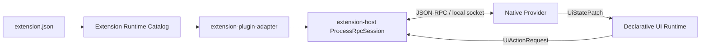

# Architecture

## 组件关系



### 1. Manifest

每个插件通过 `extension.json` 声明：

- 一个或多个 IPC runtime；
- 一个或多个 `contributes.declarativePanels`；
- provider 需要的网络、文件、secret、spawn 和 UI 权限；
- 可选的 `connections` 展示 metadata。

Phase 1 只允许 `local_socket` transport。`runtime.ipc[].entry.command` 和
`working_dir` 必须保持在 extension package 内，或使用受控的 `/usr/bin/` 命令。

### 2. Catalog

`extension-runtime` 负责读取、校验和注册 manifest。注册后的 panel 会获得：

- extension ID；
- contribution ID 和 namespaced panel key；
- namespaced runtime ID；
- 相对模板解析后的绝对路径；
- placement、icon、activation metadata。

catalog 不启动进程，也不把 `auto_restart` 当作已经存在的 supervisor。它只保存
声明和静态绑定，启动策略由更高层 activation manager 决定。

### 3. Adapter and host

`extension-plugin-adapter` 将已校验的
`RegisteredIpcRuntimeBinding` 映射为 `ProcessRpcSessionConfig`，并把 UI action
和 wire state patch 转换为 `declarative_ui_demo` 的 runtime API。

`extension-host` 的 `UniversalPluginClient` 复用既有协商、请求 ID、超时和
local-socket process session，提供 typed facade：

```text
open_resource
ping_resource
invoke_resource
close_resource
start_job
job_status
cancel_job
job_result
close_job
ui_action
ui_dialog
ui_window
```

不把 GPUI `Entity`、`dyn ComponentRenderer`、闭包或任意 UI 对象跨进程发送。

`ui_dialog` 与 `ui_window` 的 typed facade 会在发送 RPC 前执行本地 wire contract
校验；provider 只是发起描述性 request。真实 GPUI dialog、modal owner、window
focus、panel 绑定和 owner runtime / panel / extension 关闭时的自动清理，仍属于
后续 activation manager 的宿主权威职责，当前 Phase 1 不声称已经实现。

## UI 与异步工作的边界

```text
button action
  -> UiActionRequest {
       request_id, action, source_id, source_path, payload, expected_revision
     }
  -> provider / job
  -> UiStatePatch { expected_revision, operations }
  -> Runtime::apply_external_patch
  -> one state commit + one reconcile
```

Declarative UI 的状态 patch 是原子提交：revision 不匹配时整批拒绝，不产生部分
状态；空 patch 不增加 revision。provider 的网络、文件、进程和长任务工作必须在
UI runtime 外执行。

## Capability 分层

建议将能力分成四层，而不是给 provider 一个万能权限：

| 层 | 示例 | 处理方式 |
| --- | --- | --- |
| Read | `kafka/topic/list`、`docker/container/inspect` | 可自动执行但仍需声明 |
| Write | `nacos/config/publish`、`kafka/topic/create` | 单独 write 权限，界面确认 |
| Destructive | delete、offset reset、reindex、exec | 强确认、审计、最小范围 |
| Host | Docker socket、kubeconfig、secret | capability grant 和 secret reference |

密码、token、证书和 kubeconfig 不应出现在 `connections` 或普通 action payload 中。
action 只传 secret reference；宿主在 provider 启动或请求时按权限解析 secret。

## 结果与生命周期

- 短小 JSON 结果：`ResultRef::Inline`。
- 大查询、批量导出、日志：`ResultRef::Blob`。
- 消费消息、容器日志、watch/event：`ResultRef::EventStream`。
- 仍需增加宿主级 backing store、订阅、背压和清理实现。
- `job/start` 用于长操作；领域方法本身不需要污染公共 protocol enum。
