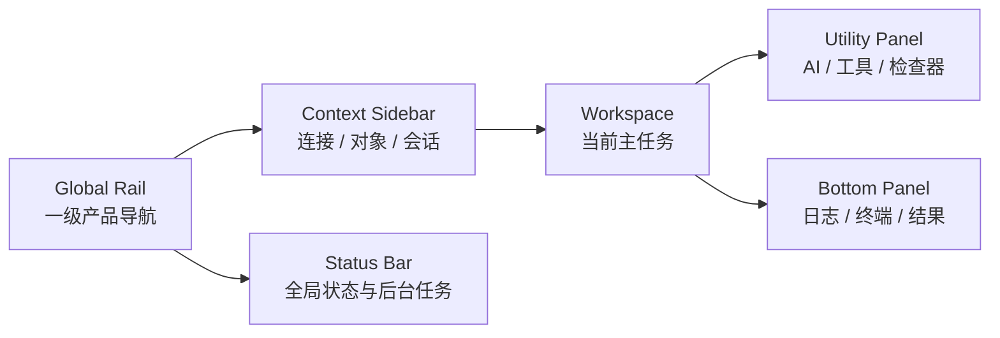

# Navop 桌面端界面与图标统一优化设计计划

| 项目 | 内容 |
| --- | --- |
| 状态 | Proposed |
| 日期 | 2026-08-03 |
| 适用范围 | Navop Desktop、GPUI Shell、`ui`、`one_ui`、图标资源、数据库、SSH/Terminal、SFTP、AI 等桌面模块 |
| 参考产品 | Codux；仅借鉴信息层级、密度控制和状态表达等高层原则，采用 clean-room 方式实现 |
| 核心目标 | 建立可持续执行、可测试、可逐步迁移的 Navop Desktop Design System |
| 本文性质 | 设计基线、工程约束、分阶段实施计划和验收清单 |

## 1. 摘要

Navop 已经具备成熟桌面工具所需的主要结构：全局导航 Rail、持久连接侧栏、标签工作区、左右/底部工具面板、状态栏，以及数据库、终端、SFTP、AI 等业务模块。当前问题不是缺少功能，而是这些区域在不同阶段、不同模块中分别演进，形成了多套视觉语言：

- 高度、宽度、间距和圆角存在大量局部硬编码；
- 同一层级的控件在不同页面使用不同密度；
- 普通操作大量使用彩色图标，状态色与行为色混淆；
- 图标在线性、填充、品牌色、尺寸、留白和命名上缺少统一规则；
- Shell、数据库、终端、SFTP、AI 等模块的 hover、selected、focus 和 disabled 表达不一致；
- 主题虽然集中管理了大量颜色，但几何尺寸、间距、阴影、透明度和动效尚未形成完整 token；
- 页面升级往往以局部“变好看”为目标，缺少可持续的系统约束，容易在后续功能开发中重新分叉。

本计划不要求一次性重写 Navop，也不改变现有业务模型。计划以“先建立规则和基础设施，再迁移 Shell 和高收益页面，最后清理旧实现”为主线，重点完成以下工作：

1. 建立统一的视觉 token；
2. 建立可执行的图标分类、尺寸、颜色、形状和资源规范；
3. 统一桌面 Shell 的信息层级和空间关系；
4. 将数据库大工具栏收敛为紧凑命令栏；
5. 统一基础组件与交互状态；
6. 分模块迁移 Home、Database、Terminal、SFTP、AI 等页面；
7. 建立截图矩阵、图标 Gallery、SVG lint 和持续集成门禁；
8. 用本文作为后续 UI 改造、代码评审和验收的共同依据。

本文中的数值分为两类：

- **规范值**：可以直接固化为 token，并在迁移中统一使用；
- **候选目标值**：必须通过 macOS/Windows、Light/Dark、1×/2× 截图验证后再冻结。

在没有完成视觉验证前，不应仅因为某个参考产品看起来更紧凑，就全局替换现有尺寸。

---

## 2. 背景与现状

### 2.1 参考界面可借鉴的高层原则

用户提供的 Codux 主界面参考图体现了以下值得借鉴的原则：

1. **区域职责清晰**
   - 最左侧 Rail 只负责一级导航；
   - 次级 Sidebar 负责当前上下文；
   - 中心区域专注当前任务；
   - 工具入口集中在顶部或边缘，不与内容竞争。

2. **视觉层级主要依赖 Surface**
   - Rail、Sidebar、Workspace 和 Status Bar 使用相近但可区分的表面色；
   - 边框较弱，主要依靠背景层级和留白分区；
   - 激活态使用小面积高对比色，而不是大面积彩色。

3. **控件密度稳定**
   - 导航、列表、标签和工具按钮分别有稳定高度；
   - 图标可见尺寸与点击区域分离；
   - 同层级内容的左边线、图标列、文字基线保持一致。

4. **颜色使用克制**
   - 主强调色集中用于当前选中项和关键动作；
   - 普通功能图标以中性色为主；
   - 状态色只表达成功、警告、危险、信息等状态。

5. **留白服务于分组**
   - 相关操作靠近；
   - 不相关操作之间通过间距或分隔线区分；
   - 页面不会同时出现过多不同半径、阴影和图标风格。

Navop 应借鉴这些高层原则，而不是复制 Codux 的源码、SVG、组件树、主题表或其他受版权保护的实现细节。

### 2.2 Navop 已有基础

Navop 当前已经具备良好的结构基础，无需推倒重来：

- `crates/core/src/tab_container.rs` 已承载主要标签、工作区和面板状态；
- `main/src/persistent_connection_sidebar/` 已包含全局 Rail 和持久连接侧栏；
- `crates/ui/src/theme/` 已集中管理颜色、字体、圆角和部分组件主题；
- `crates/ui/src/icon.rs` 已具备 `IconName`、`IconColorMode`、尺寸和着色入口；
- `crates/assets/assets/icons/` 已有较完整的本地图标资源；
- Database、Terminal、SFTP、AI 等业务模块已形成可独立迁移的页面边界。

因此，本计划的默认策略是：

> 保留现有业务状态模型和页面能力，通过 token、图标 API、基础组件和 Shell 组件逐层统一视觉表现。

### 2.3 当前主要问题

#### 2.3.1 视觉 token 不完整

`crates/ui/src/theme/mod.rs` 当前包含颜色、字体、字号、圆角、阴影开关以及 tile/list/sheet 等配置；`crates/ui/src/theme/theme_color.rs` 同时承载基础色、语义色和组件色。

目前相对集中的是“颜色”，仍大量分散的是：

- spacing；
- control height；
- icon size；
- rail/sidebar/panel 尺寸；
- radius 层级；
- border 强度；
- shadow 层级；
- opacity；
- motion duration/easing；
- 组件内部的图标与文字间距。

结果是不同模块能够使用相同主题色，却仍然看起来像不同产品。

#### 2.3.2 Shell 几何尺寸缺少统一角色

当前已存在多组高度和宽度：

- `crates/core/src/layout.rs`
  - 通用 Sidebar 默认宽度 `320px`
  - 最小宽度 `280px`
  - 最大宽度 `600px`
  - Toolbar 宽度 `44px`
- `main/src/persistent_connection_sidebar/resize.rs`
  - Connection Sidebar 默认宽度 `260px`
  - 最小宽度 `140px`
  - 最大宽度 `520px`
- `main/src/persistent_connection_sidebar/rail.rs`
  - macOS、Windows 和其他平台分别出现 `44px`、`56px`、`48px` 的 Rail 尺寸
- `crates/ui/src/title_bar.rs`
  - Title Bar 高度 `34px`
- `crates/core/src/tab_container.rs`
  - 存在 `40px` 的顶部偏移
- 其他 Dock、Tab、Header 中还存在 `29px`、`30px`、`34px` 等局部高度。

这些数字并非都错误；问题在于它们没有被命名为“窗口标题区”“内容 Tab Bar”“Panel Header”“Status Bar”等角色，后续代码无法判断应该复用哪一个。

#### 2.3.3 数据库工具栏过高、过彩

`crates/db_view/src/database_toolbar.rs` 当前定义：

```text
WORKSPACE_TOOLBAR_HEIGHT = 72px
WORKSPACE_TOOLBAR_ITEM_WIDTH = 76px
WORKSPACE_TOOLBAR_ITEM_HEIGHT = 58px
WORKSPACE_TOOLBAR_ICON_SIZE = 34px
WORKSPACE_TOOLBAR_ITEM_RADIUS = 8px
```

同时，普通操作被分配 Primary、Success、Warning、Info 等不同 tone。其结果是：

- Toolbar 占用主工作区较多垂直空间；
- 每个操作都在争夺注意力；
- success/warning/info 从“状态含义”退化为“操作分类颜色”；
- 与其他紧凑工具栏、菜单、Tab 和列表的视觉语言不一致。

#### 2.3.4 图标系统缺少分类边界

当前 `IconName` 同时包含：

- 通用功能图标；
- 线性图标；
- 填充图标；
- 彩色品牌图标；
- 数据库/协议图标；
- 资源对象图标。

业务代码可以对任意图标调用 `.color()`、`.mono()`、`.text_color(...)` 和 `.with_size(...)`，导致资源类别与表现方式由调用方临时决定。

当前可观察到：

- 线性与填充图标混用；
- 同一语义存在多个近义资源；
- 品牌色、主题色和页面硬编码协议色并存；
- Mono 与 Color 的尺寸映射不完全一致；
- 同一 `Size` 在不同文本字号下可能产生不同视觉尺寸；
- 图标命名同时使用 hyphen 与 underscore；
- SVG 的 viewBox、width/height、fill/stroke、class、属性风格不一致；
- 外部 Driver 图标没有统一的显示安全区和回退契约。

图标统一不是“把所有 SVG 换成同一种线性图标”这么简单，而是要先区分功能、状态、品牌和对象身份。

---

## 3. 设计目标

### 3.1 产品目标

1. 让 Navop 在不同业务模块中保持同一产品身份；
2. 在不降低功能可发现性的前提下提高主工作区空间利用率；
3. 让重要状态和关键操作更突出，普通操作更安静；
4. 降低新页面和新功能接入时的视觉决策成本；
5. 让 Light/Dark、macOS/Windows 和不同缩放倍率表现稳定；
6. 为后续主题扩展、可访问性和视觉回归测试打基础。

### 3.2 工程目标

1. 所有常用视觉数值都有明确 token 归属；
2. 常规图标尺寸只能通过统一的 `IconSize` 表达；
3. 图标资源类别决定其颜色和形状规则；
4. 页面代码不再直接定义协议色、常规图标裸尺寸和常用 Shell 高度；
5. 基础组件内置标准 hover、pressed、selected、focus、disabled 状态；
6. 迁移过程保持兼容，允许新旧实现短期并存；
7. CI 能阻止新的固定功能图标色、非法 SVG 和明显硬编码回流。

### 3.3 体验目标

用户应能在短时间内形成稳定预期：

- 左侧最窄区域始终是一级导航；
- 相邻 Sidebar 始终是当前任务上下文；
- 顶部 Tab/Command Bar 始终管理当前工作区；
- 右侧或底部 Panel 始终是辅助工具；
- 强调色始终意味着当前选择、焦点或主动作；
- 绿色、黄色、红色始终意味着成功、警告、危险等状态；
- 品牌色始终意味着某个数据库、协议、厂商或平台身份，而不是普通操作。

---

## 4. 非目标

本计划第一轮不包含：

1. 重写 `TabContainer` 或改变现有标签/面板业务状态模型；
2. 一次性替换全部 GPUI 组件；
3. 复制 Codux 的源代码、图标、资源或精确像素布局；
4. 为“看起来更现代”而删除已有高级功能；
5. 在未验证前固定所有候选尺寸；
6. 将所有品牌图标改成单色；
7. 将所有功能图标强制改成线性图标，不保留必要的选中/状态填充变体；
8. 首期重新设计所有对话框和业务表单；
9. 首期引入复杂动效框架；
10. 以视觉升级为理由修改数据库、SSH、SFTP 或 AI 的核心业务协议。

---

## 5. 规范语言和决策优先级

本文使用以下约束级别：

- **MUST / 必须**：新代码立即遵守；旧代码在对应迁移阶段必须消除；
- **SHOULD / 应该**：默认遵守，偏离时需在代码评审中说明原因；
- **MAY / 可以**：按场景使用；
- **候选值**：需要截图和跨平台验证后才能升级为 MUST。

遇到冲突时，优先级如下：

1. 可用性和信息准确性；
2. 可访问性、键盘操作和焦点可见性；
3. 跨平台稳定性；
4. 本文的 Design Token 和组件规范；
5. 单个页面的局部美观；
6. 对参考产品的相似度。

---

## 6. 总体设计原则

### 6.1 安静的框架，清晰的内容

Shell 是容器，不应与内容争夺注意力。Rail、Sidebar、Tab Bar 和 Status Bar 使用低饱和度表面；业务状态和主操作使用有限的强调色。

### 6.2 用层级而不是装饰分区

优先使用：

- surface 差异；
- 1px subtle border；
- 4/8/12/16 的间距节奏；
- 标题、辅助文字的字重和颜色；

谨慎使用：

- 大面积阴影；
- 高饱和渐变；
- 多层卡片嵌套；
- 每个控件不同圆角；
- 无状态含义的彩色图标。

### 6.3 密度按角色统一，不做全局一刀切

以下区域可以具有不同密度：

- 紧凑数据表；
- 标准列表；
- 设置表单；
- 空状态或引导页；
- 全局 Rail；
- 触摸友好的大按钮。

同一角色必须统一，而不是所有控件强制同高。

### 6.4 可见图标与命中区分离

`20px` 图标不代表按钮只能是 `20px`。点击命中区应根据角色保持 `28–40px`，避免为了紧凑牺牲可操作性。

### 6.5 状态颜色只表达状态

绿色、黄色、红色、蓝色状态色不应用于区分“查询”“结构”“导入”“导出”等普通操作。普通操作以中性色呈现，主操作才使用 accent。

### 6.6 渐进迁移优先

新 token 和组件先提供兼容层；页面按价值和风险逐步迁移；旧字段在所有调用方迁移完成后再删除。

---

## 7. 目标信息架构



### 7.1 Global Rail

职责：

- 产品级一级导航；
- 当前模块选中状态；
- 底部全局入口，如新建、设置和更多；
- 在必要时显示轻量 badge。

不承担：

- 连接树；
- 长文本标签；
- 业务详情；
- 多行操作组；
- 大量品牌彩色图标。

### 7.2 Context Sidebar

职责：

- 显示当前模块的上下文；
- 承载连接、对象树、会话、文件、收藏等导航；
- 支持搜索、筛选、折叠和 resize；
- 在空间不足时优先保证主工作区。

### 7.3 Workspace

职责：

- 显示当前主要任务；
- 通过 Tab 管理并行任务；
- 通过 Command Bar 提供与当前任务最相关的操作；
- 保持最大可用内容面积。

### 7.4 Utility Panel

职责：

- AI、属性、检查器、历史、帮助等辅助能力；
- 默认可折叠；
- 在较窄窗口中支持覆盖层或互斥展开；
- 默认宽度按“扣除 Global Rail 与 Context Sidebar 后的内容区”计算；
- 默认不应超过该内容区的 28%，同时受 `340–380px` 候选范围约束；
- 主 Workspace 的持久最小宽度暂定 `640px`；低于该阈值时 Utility Panel 应折叠或转为覆盖层；
- 用户主动拖大属于当前窗口会话的临时覆盖值，可以持久化，但下次恢复时仍须根据当前窗口尺寸重新 clamp；
- 用户覆盖值不得导致主 Workspace 低于持久最小宽度；需要更大面板时应进入临时最大化/覆盖模式。

### 7.5 Bottom Panel

职责：

- 日志、终端、执行输出、结果、任务等横向信息；
- 支持 resize、折叠和最大化；
- Header、Tab 和操作按钮遵循统一 Panel 规范。

---

## 8. Design Token 体系

### 8.1 Token 分层

目标 token 结构：

```text
Theme
├── palette          原始颜色值
├── color
│   ├── semantic     跨组件语义色
│   └── component    少量必要的组件别名
├── typography
├── spacing
├── radius
├── control_size
├── icon_size
├── layout_size
├── border
├── shadow
├── opacity
└── motion
```

使用顺序：

1. 页面优先使用语义 token；
2. 基础组件可以使用 component token；
3. 只有主题定义层可以直接引用 palette；
4. 业务页面不得直接引用原始十六进制、RGB 或 HSL 作为常规视觉样式；
5. 品牌资源和数据可视化是例外，但必须通过集中注册表管理。

### 8.2 Color Token

建议的核心命名：

```text
surface.canvas
surface.chrome
surface.sidebar
surface.panel
surface.raised
surface.control
surface.hover
surface.selected
surface.overlay

border.subtle
border.default
border.strong
border.focus

text.primary
text.secondary
text.muted
text.disabled
text.on_accent

icon.primary
icon.secondary
icon.muted
icon.disabled
icon.active

accent.default
accent.hover
accent.pressed
accent.subtle

status.success
status.warning
status.danger
status.info

state.hover
state.pressed
state.selected
state.focus
state.disabled
```

规则：

- `surface.canvas` 用于主内容背景；
- `surface.chrome` 用于窗口框架、顶部区域；
- `surface.sidebar` 用于 Rail/Sidebar 层；
- `surface.panel` 用于右侧和底部辅助面板；
- `surface.raised` 用于 Popover、Menu、Dialog；
- `surface.control` 用于输入框和静态控件背景；
- `surface.hover` 与 `surface.selected` 必须在 Light/Dark 均可区分；
- selected 不只依赖颜色，应可配合左侧 indicator、字重或图标色；
- `status.*` 不作为普通按钮类别颜色。

### 8.3 Typography Token

建议角色：

```text
type.caption
type.body
type.body_strong
type.label
type.panel_title
type.page_title
type.monospace
type.numeric
```

规则：

- 标题层级通过字号、字重和间距共同表达；
- 侧栏分组标题不应与页面标题同等级；
- 辅助文字使用 `text.secondary` 或 `text.muted`，不通过极小字号隐藏；
- 数据表、终端、SQL 编辑器等保持 monospace 角色；
- 字号应集中由 theme 管理，不在页面临时出现多个相近值。

### 8.4 Spacing Token

基础节奏：

| Token | 数值 | 用途 |
| --- | ---: | --- |
| `space.1` | 4px | 图标内部微间距、紧凑元素 |
| `space.2` | 8px | 图标与文字、紧凑行内间距 |
| `space.3` | 12px | 标准控件内边距、小分组 |
| `space.4` | 16px | 面板内边距、标准分组 |
| `space.5` | 20px | 中型区域间距 |
| `space.6` | 24px | 页面级区块间距 |
| `space.8` | 32px | 空状态、大区块 |

规则：

- 新代码 MUST 从 spacing token 选择；
- `6px`、`10px` 等中间值仅允许基础组件为像素对齐使用；
- 列表同级内容必须共享图标列、文字列和尾部操作列；
- 分组间距必须大于组内间距。

### 8.5 Radius Token

| Token | 数值 | 用途 |
| --- | ---: | --- |
| `radius.none` | 0px | 数据网格连续单元、贴边区域 |
| `radius.xs` | 4px | 紧凑控件、小 badge |
| `radius.sm` | 6px | 标准按钮、输入框、列表选中面 |
| `radius.md` | 8px | 卡片、Popover 内部区域 |
| `radius.lg` | 12px | Dialog、空状态大容器 |
| `radius.pill` | 999px | 状态胶囊、头像、计数 badge |

同一组件同一状态必须使用同一 radius。嵌套容器的内层 radius 应小于或等于外层 radius。

### 8.6 Control Size Token

| Token | 高度 | 典型用途 |
| --- | ---: | --- |
| `control.compact` | 24px | 表格内联操作、极紧凑 chip |
| `control.small` | 28px | 紧凑工具按钮、列表尾部操作 |
| `control.default` | 32px | 标准按钮、输入框、Select |
| `control.medium` | 36px | Command Bar 内部按钮、强调操作 |
| `control.large` | 40px | Rail hit target、较大入口 |
| `control.xlarge` | 44px | 页面主操作、触摸友好入口 |
| `control.hero` | 48/52px | 少量引导页、连接类型大入口 |

不要把“图标可见尺寸”和“Control 高度”合并为一个 enum。

`control.*` 表达单个可交互控件的命中高度，`layout.*` 表达包含 padding、分组和边界的区域高度。例如 Command Bar 容器可以是 `44–48px`，其中的 Icon Button 使用 `control.medium = 36px`。两者不是同一角色，不应互相替代。

### 8.7 Layout Size Token

候选角色化尺寸：

| Token | 候选目标 | 说明 |
| --- | ---: | --- |
| `layout.title_bar` | 34–36px | 窗口标题/拖拽区；允许平台窗口装饰差异 |
| `layout.tab_bar` | 40px | 主工作区标签 |
| `layout.command_bar` | 44–48px | 页面命令栏 |
| `layout.panel_header` | 36px | 左右/底部面板标题 |
| `layout.status_bar` | 28px | 底部状态栏 |
| `layout.global_rail` | 52px | 内容 Rail 的首选目标 |
| `layout.compact_rail` | 44px | 仅用于明确的紧凑工具 Rail |
| `layout.context_sidebar_default` | 260–280px | 连接/对象上下文侧栏 |
| `layout.utility_panel_default` | 340–380px | AI/检查器 |

Rail 策略：

- macOS 交通灯和 Windows 系统按钮可以有平台差异；
- 内容 Rail MUST 使用统一的角色 token；
- 不再允许内容 Rail 因平台分别随意出现 `44/48/56px` 三套值；
- 初始候选值为 `52px`，在低分辨率截图验证后决定是否调整；
- 极紧凑工具 Rail 可以使用 `44px`，但必须是另一个明确角色。

Sidebar 策略：

- 默认宽度候选 `260–280px`；
- 最小宽度候选从当前 `140px` 上调至 `220–240px`，避免内容不可读；
- 最大宽度可保留约 `520px`；
- 当窗口宽度不足时，应折叠 Utility Panel，而不是无限压缩主 Workspace；
- resize 的最终值可以持久化，但加载时必须 clamp 到当前 token 范围。

### 8.8 Border、Shadow、Opacity、Motion

Border：

- Shell 分区默认使用 `border.subtle`；
- 输入焦点使用 `border.focus` 或等价 focus ring；
- 禁止每层容器都添加边框；
- 相邻同色 surface 可以通过单侧边框分区。

Shadow：

- `shadow.none`：常规 Shell；
- `shadow.popover`：菜单、Popover；
- `shadow.dialog`：Dialog、Sheet；
- Dark 主题不能只依赖黑色阴影，应结合 border；
- 不用阴影表达 selected。

Opacity：

- disabled 透明度集中管理；
- 未选中 Rail 图标不应通过任意页面 `0.72` 等裸值控制；
- 品牌图标避免整体 opacity 导致品牌色发灰，可改用外层 surface 和文字层级弱化。

Motion：

- hover/pressed：约 `80–120ms`；
- panel 展开/折叠：约 `160–220ms`；
- 尊重 reduced motion；
- 首期只统一 duration/easing，不引入装饰性动画。

---

## 9. 图标系统规范

图标统一是本计划的独立基础工程，不应被当作页面改造的附属工作。

### 9.1 当前资源和 API

图标资源位于：

```text
crates/assets/assets/icons/
```

由 `crates/assets/src/lib.rs` 嵌入应用。当前资源约两百余个，包含通用图标、数据库和协议品牌、文件/对象类型等。

入口 API 位于：

```text
crates/ui/src/icon.rs
```

当前主要能力包括：

- `IconName`
- `IconColorMode::Mono`
- `IconColorMode::Color`
- `IconName::color()`
- `IconName::mono()`
- `.text_color(...)`
- `.with_size(...)`

问题不在于 API 没有能力，而在于它允许调用方绕过资源类型规则。

### 9.2 当前不一致类型

图标迁移前必须建立 inventory，至少标记以下问题：

1. 线性与填充图标混用；
2. 功能图标和品牌图标混用；
3. 品牌色、主题色、硬编码协议色同时存在；
4. Mono 与 Color 的尺寸规则不同；
5. 同一语义存在多个资源，如：
   - `database.svg`
   - `database_line.svg`
   - `postgresql_color.svg`
   - `postgresql_line_color.svg`
   - `folder.svg`
   - `folder-open.svg`
   - `folder_open_color.svg`
6. 文件名同时使用 hyphen 和 underscore；
7. SVG viewBox、width/height、fill/stroke、class、style、引号格式不一致；
8. 外部 Driver 图标缺少统一留白和尺寸契约；
9. 任意 `IconName` 都可被调用方切换 `.color()`/`.mono()`；
10. 普通功能操作使用 success/warning/info 彩色 tone；
11. 同一个图标在 Rail、Toolbar、Menu、Tree 中可能使用不同裸尺寸；
12. 个别 SVG 在 Dark 主题可能因为固定黑色而不可见；
13. 大 viewBox 品牌图标与 24×24 功能图标放在同一尺寸盒子后，视觉占比不一致。

### 9.3 图标类别

所有图标 MUST 归入以下四类之一。

#### A. Functional Outline

默认 UI 行为图标，例如：

- 新建；
- 打开；
- 保存；
- 刷新；
- 搜索；
- 筛选；
- 关闭；
- 更多；
- 复制；
- 删除；
- 展开/折叠；
- 前进/后退；
- 上传/下载。

规范：

- 默认 `24×24` viewBox；
- `fill="none"`；
- `stroke="currentColor"`；
- stroke width 暂定 `1.75`；
- round linecap 和 linejoin；
- 视觉重量一致；
- 默认以 `icon.secondary` 显示；
- active/primary 场景才使用 accent。

`1.75` 是候选值，冻结前必须在 macOS/Windows、1×/2×、Light/Dark 下与 `2.0` 做对比截图。

#### B. Functional Filled

只用于状态已经发生或必须依靠实体轮廓提高识别度的场景，例如：

- favorite selected；
- checkbox/radio selected；
- visibility state；
- pin active；
- record/stop 等明确媒体状态；
- unread dot。

规范：

- filled 变体必须与 outline 变体具有同一外轮廓和视觉中心；
- 不因“看起来更醒目”就在普通 Toolbar 中使用 filled；
- 同一交互的默认态/选中态可以 outline → filled，但尺寸和对齐不能跳动；
- 填充不等于彩色，颜色仍遵循功能图标语义。

#### C. Brand Color

用于表达身份：

- PostgreSQL、MySQL、Redis、MongoDB 等数据库；
- Windows、macOS、Linux；
- 云厂商、第三方服务；
- Driver、Vendor、Protocol 品牌。

规范：

- 保留必要的官方品牌色；
- 不允许调用 `.text_color(...)` 改色；
- 不用于“执行查询”“新建连接”等普通行为；
- 必须通过 contain 方式放入统一图标盒子；
- 资源必须记录来源和许可证；
- 在高对比背景上必要时使用中性承载面，不随意增加描边；
- 同一品牌只保留一个 canonical 资源，除非官方明确提供适配 Light/Dark 的变体。

#### D. Object Glyph

用于表达资源对象，而不是产品品牌，例如：

- database；
- schema；
- table；
- view；
- column；
- index；
- key；
- function；
- folder/file；
- connection/session。

规范：

- 默认 monochrome outline；
- 形状与 Functional Outline 使用同一视觉重量；
- 可以由 selected/active theme 着色；
- 不使用数据库品牌色区分 table、view、schema 等对象类别；
- 同一对象在 Tree、Breadcrumb、Tab 中使用同一个 canonical glyph。

### 9.4 图标尺寸

统一尺寸 token：

| Token | 可见尺寸 | 典型用途 |
| --- | ---: | --- |
| `IconSize::Micro` | 12px | 辅助箭头、状态徽标、紧凑后缀 |
| `IconSize::Small` | 14px | 紧凑列表、内联辅助图标 |
| `IconSize::Default` | 16px | 文本按钮、菜单、表单控件 |
| `IconSize::Medium` | 20px | Toolbar、对象树一级入口 |
| `IconSize::Large` | 24px | Global Rail、空状态次级视觉 |
| `IconSize::Display` | 32px | 卡片、连接类型选择 |
| `IconSize::Hero` | 40px | 少量新建连接/空状态主视觉 |

规则：

- Mono 和 Color MUST 映射到同一组绝对 px token；
- 未显式指定尺寸时，标准 `Icon` 默认使用 `Default = 16px`，不得依赖当前文本字号推导；
- 只有 icon 与行内字体严格绑定的专用 `InlineIcon` 可以使用 em；
- 常规 Toolbar 不使用 `Display` 或 `Hero`；
- 当前新建连接页中的裸 `40px` 应迁移为 `IconSize::Hero`；
- 页面代码不得新增 `.with_size(px(...))`；
- 特殊尺寸需要先扩展有语义名称的 token，并说明用途。

### 9.5 命中区与可见尺寸

建议映射：

| Hit target | Icon | 用途 |
| ---: | ---: | --- |
| 28px | 14px | 表格内联操作 |
| 32px | 16px | 标准紧凑按钮 |
| 36px | 16/20px | Command Bar、Panel Header |
| 40px | 20/22/24px | Global Rail、主要工具入口 |

规则：

- 点击区域 MUST 不小于组件角色规定值；
- hover/selected 背景覆盖命中区，而不是只包住 SVG；
- 相邻图标按钮之间至少保留可感知间距或共享分组容器；
- tooltip 绑定到命中区；
- 禁止为了统一图标大小而缩小可点击区域。

### 9.6 图标颜色

#### 功能图标

| 状态 | 颜色 |
| --- | --- |
| 默认 | `icon.secondary` |
| 强调/主要 | `icon.primary` 或 `accent.default` |
| hover | 由组件状态统一处理 |
| active/selected | `icon.active` |
| disabled | `icon.disabled` |
| destructive | 只有危险操作使用 `status.danger` |

#### 状态图标

- success → `status.success`
- warning → `status.warning`
- danger/error → `status.danger`
- info → `status.info`

#### 品牌图标

- 保留资源固定颜色；
- 不参与普通主题 tint；
- selected 通过背景、边框、文字或外层 indicator 表达；
- 如果未选中态需要降低视觉权重，优先降低相邻文字/表面层级，不直接将品牌图标 opacity 随意降为裸值。

#### Rail

- 未选中一级导航默认使用 monochrome；
- 当前选中项使用 selected surface + active icon + 必要的侧边 indicator；
- 数据库/协议品牌色只在身份识别场景出现，不让整个 Rail 变成多色启动器；
- 当前 `main/src/persistent_connection_sidebar/rail.rs` 中的协议硬编码颜色应迁移到集中式 visual registry。

### 9.7 形状和视觉重量

Functional Outline 和 Object Glyph：

```text
viewBox       0 0 24 24
fill          none
stroke        currentColor
stroke width  1.75（候选）
linecap       round
linejoin      round
background    transparent
```

几何要求：

- 图形视觉中心对齐画布中心；
- 默认安全区约 2px，不贴边；
- 圆角风格与整体产品相符；
- 不混入完全不同的尖角、粗线、手绘或实体风格；
- 箭头、chevron、close、plus/minus 等基础符号必须来自同一套 canonical family；
- 同组对象图标在相同尺寸下具有相近视觉占比；
- 细节在 `12–14px` 下无法辨认时，应提供简化的小尺寸设计，而不是直接缩放复杂 SVG。

### 9.8 SVG 资源规范

#### Functional / Object SVG

MUST：

- 有 `viewBox="0 0 24 24"`；
- 不写固定 `width`/`height`；
- 不包含固定 hex/rgb/hsl 色；
- 使用 `currentColor`；
- 不包含 `<style>`、`class`、无用 `id`；
- 透明背景；
- 文件名使用 kebab-case；
- 删除设计工具生成的 metadata；
- 路径精度合理，避免无意义超长小数；
- 在 Light/Dark 下均可见。

SHOULD：

- 使用统一 stroke width；
- 使用 round cap/join；
- 尽量避免 clipPath/mask；
- 避免依赖 fill-rule 的复杂组合；
- 在 16px 和 20px 下检查清晰度。

#### Brand SVG

MAY：

- 保留原始 viewBox；
- 保留固定品牌色；
- 保留必要 fill-rule、clipPath 和渐变。

MUST：

- 透明背景；
- 无强制外部显示 `width`/`height`，或在导入阶段标准化；
- 通过外层 `contain` 归一化；
- 声明品牌来源和许可证；
- 有统一视觉安全区；
- 不因 SVG 原始画布比例改变布局；
- 在加载失败时回退到标准 Brand/Connection 占位图标。

### 9.9 命名规范

文件名统一 kebab-case：

```text
refresh.svg
folder-open.svg
database.svg
postgresql-color.svg
star-filled.svg
```

命名后缀：

- 默认 Functional Outline 不加 `-outline`，例如 `refresh.svg`；
- Filled 变体使用 `-filled`；
- Brand 彩色变体使用 `-color`；
- 明确 Light/Dark 官方变体使用 `-light` / `-dark`；
- 不再新增 `_line`、`_color` 等 underscore 命名。

同语义 canonical 规则：

- 一个“语义”默认只有一个 canonical icon family；
- canonical family 可以包含受控视觉变体：
  - `outline`：默认功能态；
  - `filled`：同一功能语义的明确选中/状态态；
  - `color`：同一 Brand 的官方彩色资源；
  - `light` / `dark`：只有官方资源或可读性确有需要时存在；
- variant 必须登记在同一 metadata 下，不得作为互不关联的 `IconName` 漂移；
- 不同平台只有在平台语义或官方品牌确实不同的情况下才允许独立变体；
- 别名只保留在 Rust API 兼容层，不复制 SVG；
- 重复资源在迁移期标为 deprecated；
- duplicate 报告首期为 warning；对应模块迁移完成后升级为 error；
- 删除前必须通过引用扫描和运行时资源清单确认无调用。

### 9.10 Rust API 目标

长期建议按三个资源族隔离：

```rust
FunctionalIconName
BrandIconName
ObjectIconName
```

`Functional Outline` 与 `Functional Filled` 属于同一个 Functional 资源族，但必须由显式 style/variant 区分，而不是由调用方随意换文件：

```rust
pub enum FunctionalIconStyle {
    Outline,
    Filled,
}
```

默认值必须是 `Outline`。只有 metadata 声明支持 filled 状态、且当前组件状态允许时，才能请求 `Filled`。因此图标审计仍按四类统计，Rust 公共资源族保持三个，二者并不冲突。

如果首期拆分 `IconName` 风险过大，可以先提供受约束构造入口：

```rust
FunctionalIcon::new(name)
BrandIcon::new(name)
ObjectIcon::new(name)
```

约束：

- `FunctionalIcon` 允许 theme color，不允许 Brand 资源；
- `BrandIcon` 不暴露 `.text_color(...)`；
- `ObjectIcon` 默认 monochrome，可使用语义 selected color；
- 三类图标共享同一 `IconSize`；
- `IconSize` 显式映射 px；
- deprecated 的 `.color()` / `.mono()` 只在兼容层内部使用；
- 页面代码不再自行决定某个资源到底是 Brand 还是 Functional；
- Resource Registry 能返回分类、canonical 名称、fallback 和许可元数据。

可能的过渡结构：

```rust
pub enum IconKind {
    Functional,
    FunctionalFilled,
    Brand,
    Object,
}

pub struct IconMetadata {
    pub kind: IconKind,
    pub canonical_name: &'static str,
    pub license: Option<&'static str>,
    pub source: Option<&'static str>,
}
```

### 9.11 协议和连接视觉注册表

新增集中式 `ProtocolVisuals` 或 `ConnectionVisuals`：

```text
protocol/driver id
├── brand icon
├── monochrome fallback icon
├── display name
├── optional brand color
├── optional dark/light variant
└── accessibility label
```

规则：

- 页面不得为 Database/Redis/SSH/SFTP 等协议硬编码 HSL/RGB；
- brand color 只用于身份区域；
- Rail 默认请求 monochrome fallback；
- 新建连接页可以请求 brand icon；
- Tree/Object 仍使用对象 glyph，不滥用品牌 icon；
- 未知或第三方 Driver 使用统一 fallback；
- Driver 提供的图标必须经过安全区和尺寸容器处理。

### 9.12 外部 Driver 图标契约

外部图标必须满足：

- SVG 或受支持的透明位图；
- 透明背景；
- 使用 contain，不裁剪；
- 周围具有统一安全区；
- 原始尺寸不影响布局；
- 加载失败、解码失败或资源缺失时有 fallback；
- 不允许执行脚本或引用远程资源；
- 资源类别决定是否允许固定颜色；
- 显示名称和无障碍文本不依赖图标本身；
- Manifest 中记录来源、作者和许可证；
- Gallery 中可以预览第三方图标与内置图标的视觉占比。

安全契约必须在实现阶段冻结，最低要求：

- 只接受明确白名单 MIME 和扩展名；
- 拒绝脚本、事件处理属性、外部 URL、远程字体、`foreignObject` 和递归引用；
- SVG 在进入渲染层前必须 sanitize；
- 文件大小、解压后大小、节点数、路径复杂度和嵌套深度必须有限制；
- 解析、sanitize、缓存和渲染失败必须隔离，不能阻塞连接列表或主线程；
- 失败时记录可诊断日志，但 UI 使用固定尺寸 fallback，不能发生布局抖动；
- 不直接信任文件扩展名，应验证实际内容类型；
- 缓存键至少包含资源内容哈希和 sanitizer 版本；
- 具体解析库和阈值由实现设计文档选定，并通过畸形 SVG、资源炸弹和远程引用测试。

### 9.13 Icon Gallery 和自动化门禁

建立开发态 Icon Gallery，至少支持：

- 按类别筛选；
- 按名称搜索；
- 同时显示 12/14/16/20/24/32/40px；
- Light/Dark；
- 默认、hover、selected、disabled；
- 1×/2× 截图；
- 品牌图标安全区；
- deprecated 和 duplicate 标记；
- canonical 名称和源文件路径；
- 许可信息。

SVG lint/CI 检查：

1. 缺少 viewBox；
2. Functional/Object SVG 含固定 hex/rgb/hsl；
3. 非法 width/height/class/style；
4. 非 kebab-case 文件名；
5. 重复或近义资源报告；
6. Brand 图标被业务代码 tint；
7. 普通页面新增裸 `.with_size(px(...))`；
8. 常规按钮新增裸图标 `px(...)`；
9. 未登记的外部 Brand 资源；
10. Dark 主题下潜在固定黑色资源。

Lint 应分两阶段启用：

- 首期只对新增/修改文件报错，对历史问题生成报告；
- 完成主要迁移后，对全量资源启用强制检查。

---

## 10. 组件视觉规范

### 10.1 Global Rail

结构：

```text
Window spacer（平台相关）
Primary navigation
Flexible spacer
Create / Settings / More
```

规范：

- 内容 Rail 使用统一宽度 token；
- 图标默认 `IconSize::Large` 或经验证后的 20–22px；
- hit target `40px` 左右；
- selected surface 使用 `radius.sm`；
- 当前项可使用 2–3px 左侧 indicator；
- badge 不遮挡主图标；
- tooltip 显示名称和快捷键；
- 底部入口保持固定顺序；
- 品牌多色图标不作为默认一级导航风格。

### 10.2 Context Sidebar

规范：

- Header 使用 `layout.panel_header`；
- 搜索/过滤使用标准 `control.default`；
- Tree/List 行高按 `compact` 或 `default` 角色统一；
- 一级对象与二级对象使用统一缩进步长；
- chevron 占据固定图标列；
- 尾部操作默认 hover 后出现，但不能造成文字位移；
- selected 依靠 surface + 文字/图标色，不用强阴影；
- 分组标题、计数 badge、空状态均复用基础组件；
- resize handle 视觉弱，但命中区足够；
- 最小宽度不得让主要名称完全不可识别。

### 10.3 Tab Bar

规范：

- 主 Tab Bar 候选高度 `40px`；
- Tab 图标默认 16px；
- 标题单行截断；
- dirty/状态 indicator 有固定位置；
- close 按钮使用统一命中区；
- selected 与 hover 清晰区分；
- pinned、preview、normal 等状态不能仅依赖颜色；
- 拖拽状态提供明确插入位置；
- 不在每个 Tab 上使用独立卡片阴影。

### 10.4 Title Bar

规范：

- 区分窗口系统装饰区和内容导航区；
- 可拖拽区域不能覆盖交互控件；
- macOS 交通灯保留平台安全区；
- Windows 系统按钮遵守原生交互预期；
- 内容高度通过 `layout.title_bar` 管理；
- 不为了跨平台像素完全一致而破坏原生窗口行为。

### 10.5 Command Bar

用于替代过高的页面大工具栏。

规范：

- 候选高度 `44–48px`；
- 图标 16–20px；
- 操作按任务频率分组；
- 最多一个主要 accent 操作；
- 次要操作中性显示；
- 危险操作只有执行前或确认区使用 danger；
- 低频操作进入 overflow；
- 支持文字标签在空间不足时收敛；
- icon-only 必须有 tooltip；
- 分隔线只用于语义分组。

### 10.6 Button

按钮层级：

- Primary：当前上下文唯一主动作；
- Secondary：常用次动作；
- Ghost：Toolbar、Panel、列表尾部操作；
- Destructive：删除、终止、不可逆操作；
- Icon Button：图标行为，必须有 tooltip/accessible label。

统一内容：

- Icon + Label 间距使用 `space.2`；
- 高度来自 Control Size；
- 图标来自 Icon Size；
- radius 来自 token；
- focus ring 必须可见；
- loading 不改变按钮宽度；
- disabled 不只依赖 opacity，还要禁止交互并使用 disabled token。

### 10.7 Input / Select / Search

规范：

- 标准高度 `control.default`；
- 图标 16px；
- 前后缀位置固定；
- placeholder、value、disabled 层级清晰；
- error 使用 border + message，不只改变图标颜色；
- Search 的 clear 按钮有独立命中区；
- 表单 label、description、error 使用稳定垂直节奏。

### 10.8 Tree / List

规范：

- 同角色共享行高；
- 图标列固定；
- 展开箭头不因对象是否有图标而错位；
- 文本 baseline 稳定；
- hover 不改变 layout；
- selected、focused、drop target 分别可区分；
- badge 使用 pill token；
- 远程/离线/错误等状态通过专用 status indicator 表达；
- 列表普通对象不使用多种随机品牌色。

### 10.9 Table / Data Grid

规范：

- Header、Row、Cell 使用独立密度 token；
- 数值对齐、NULL、错误和只读状态统一；
- 行 hover 与单元 selected 不混淆；
- 边框使用 subtle；
- 内联图标按钮使用 compact 命中区；
- 状态色只用于状态；
- 大数据量下优先性能，不为视觉效果增加昂贵阴影或复杂层。

### 10.10 Panel

结构：

```text
Panel Header
Optional Tab/Toolbar
Content
Optional Footer/Status
```

规范：

- Header 统一 `36px` 候选值；
- 标题、图标、badge、操作基线一致；
- collapse、maximize、close 使用同一图标按钮组件；
- resize handle 统一；
- 左、右、底部 Panel 使用同一状态模型和视觉语言；
- 嵌套 Panel 不重复添加完整边框与标题栏。

### 10.11 Menu / Popover / Dialog / Sheet

规范：

- 使用 `surface.raised`；
- border 与 shadow 由 overlay token 管理；
- 菜单图标固定 16px 列；
- 快捷键右对齐；
- destructive 菜单项只在必要时使用 danger；
- Dialog 的主次按钮顺序保持平台和产品一致；
- Sheet/Popover 不创建新的局部图标风格；
- 关闭按钮、标题和内边距复用统一 Header 结构。

### 10.12 Status Bar

规范：

- 候选高度 `28px`；
- 只显示全局、后台或当前工作区状态；
- 普通信息使用 muted；
- 错误/警告使用状态 icon + 文本；
- 点击项提供 hover；
- 不堆叠完整按钮；
- 网络、远程、任务和索引状态使用统一状态表达。

---

## 11. 页面级改造计划

### 11.1 App Shell

优先级最高。

工作：

- 统一 Rail 内容宽度和图标命中区；
- 统一 Connection Sidebar 默认/最小/最大宽度；
- 抽取 Title Bar、Tab Bar、Panel Header、Status Bar token；
- 统一 Shell surface 和 border；
- 统一 selected/hover/focus；
- 收敛右侧 AI/Utility Panel；
- 保留平台窗口装饰差异；
- 不改变 `TabContainer` 核心业务状态。

### 11.2 Home / Connection

目标：

- 从“不同类型卡片和图标集合”收敛为稳定的连接入口；
- 使用 Brand Icon 表达数据库/协议身份；
- 使用统一列表或卡片尺寸；
- 收藏、最近、团队和本地连接使用一致状态；
- 新建连接 Hero 图标通过 `IconSize::Hero`；
- 连接失败、离线、同步中使用状态图标，不更改品牌主色；
- 连接类型选择在 Display/Hero 尺寸下检查视觉安全区。

### 11.3 Database

最高收益页面。

工作：

- 将 `72px` Workspace Toolbar 收敛为 `44–48px` Command Bar；
- 将 `34px` 图标收敛为 16–20px；
- 只保留一个主要 accent 动作；
- 普通查询、结构、数据、导入导出等操作使用中性色；
- 低频操作进入 overflow；
- Object Tree 使用统一 Object Glyph；
- SQL Tab、数据表、属性面板使用统一 Header；
- success/warning/info 只表达执行状态；
- 保持现有 action 和业务能力，先改变呈现方式。

### 11.4 SSH / Terminal

目标：

- Terminal 保持内容优先；
- 会话、分屏、重连、上传下载等操作进入紧凑 Command Bar；
- Shell/Host/Session 使用明确对象图标；
- 连接状态使用 status indicator；
- 分屏和 Panel 操作复用全局图标；
- monospace、终端背景和 selection 维持专业可读性；
- 不因统一主题降低 ANSI 色彩辨识度。

### 11.5 SFTP

目标：

- 本地/远程两侧使用统一 Header 和路径导航；
- folder/file 使用 canonical Object Glyph；
- 上传、下载、刷新、创建目录使用 Functional Outline；
- 传输进度、成功、失败使用状态色；
- 选中、拖放目标、冲突状态可区分；
- 不使用品牌彩色图标表达普通文件行为。

### 11.6 AI

目标：

- AI 作为 Utility Panel，而不是另一套独立产品 Shell；
- Header、Tab、close/maximize 复用 Panel 规范；
- 输入区使用标准 control、button、attachment 图标；
- tool call、thinking、success/error 使用一致状态；
- 默认宽度候选 `340–380px`；
- 可折叠，窄窗口中可覆盖或互斥显示；
- 不超过主 Workspace 可用宽度约 28%，除非用户主动放大；
- 消息内容可以保留特有布局，但基础控件不得另起视觉语言。

### 11.7 Markdown / ER / Redis / MongoDB / Remote Editor

在 Shell 和基础组件稳定后迁移：

- Header、Tab、Toolbar、Tree、Status 使用公共组件；
- 业务专属图标先分类为 Functional、Brand 或 Object；
- 删除重复的局部色和尺寸；
- 保留业务内容区必要的专业视觉，例如 ER 节点、语法高亮和数据图表；
- 专业数据颜色与 UI 状态颜色分开管理。

---

## 12. 建议代码架构

### 12.1 Theme

目标目录：

```text
crates/ui/src/theme/
├── mod.rs
├── palette.rs
├── semantic_color.rs
├── component_color.rs
├── typography.rs
├── spacing.rs
├── radius.rs
├── control_size.rs
├── icon_size.rs
├── layout_size.rs
├── border.rs
├── shadow.rs
├── opacity.rs
└── motion.rs
```

不要求第一阶段立即拆成所有文件。可以先在现有 `Theme` 增加结构，再在稳定后整理目录。

兼容策略：

1. 新增 token 字段；
2. 旧字段继续存在并映射到新 token；
3. 新组件只能使用新字段；
4. 逐模块迁移旧调用；
5. 编译期标记 deprecated；
6. 全部迁移后删除兼容字段。

### 12.2 Icon

目标目录：

```text
crates/ui/src/icon/
├── mod.rs
├── name.rs
├── metadata.rs
├── size.rs
├── functional.rs
├── brand.rs
├── object.rs
└── gallery.rs
```

初期可以继续使用单个 `icon.rs`，但代码结构应体现：

- 类型/类别；
- 尺寸；
- metadata；
- 渲染；
- 兼容入口；
- Gallery 数据。

### 12.3 Layout

`crates/core/src/layout.rs` 应逐步从少量通用常量升级为角色化 Shell 几何 token 的消费层，而不是第二个 Theme。

推荐职责：

- Theme 定义视觉/几何 token；
- Core Layout 根据窗口和平台计算实际布局；
- 业务页面消费角色化结果；
- 用户 resize 值通过 clamp 与持久化层管理。

### 12.4 Protocol Visual Registry

集中管理：

- built-in protocol；
- built-in driver；
- extension driver；
- brand icon；
- fallback；
- display name；
- optional brand color；
- source/license。

禁止：

- Rail 单独维护一份颜色表；
- 新建连接页单独维护一份图标表；
- Sidebar 再维护另一份 fallback；
- 页面按字符串匹配决定图标。

### 12.5 执行治理与候选值冻结

#### 角色

以下角色是职责，不绑定具体人员：

- **Design Owner**：维护本文、确认视觉方向、签核候选值；
- **UI Foundation Owner**：维护 Theme、Icon、基础组件和 lint；
- **Shell Owner**：维护 Rail、Sidebar、Tab、Panel 和 Status Bar；
- **Module Owner**：负责 Database、Terminal、SFTP、AI 等模块行为回归；
- **Release Verifier**：执行跨平台截图、键盘操作和发布前 smoke test；
- **License Reviewer**：审核第三方图标来源、许可证和分发义务。

一个人可以承担多个角色，但每个执行 Issue 必须明确责任角色和最终签核人。

#### 候选值决策流程

所有“候选值”必须建立一条决策记录：

| 字段 | 说明 |
| --- | --- |
| Role | 被决定的角色，如 `layout.global_rail` |
| Candidates | 允许比较的有限候选集合 |
| Test Matrix | 平台、主题、视口和缩放 |
| Evidence | 对比截图、测量值、行为测试 |
| Metrics | 内容占用、命中区、对齐、对比度、截断等 |
| Decision Owner | 最终签核角色 |
| Result | Frozen / Rejected / Context-specific |
| Date | 决策日期 |
| Follow-up | 需要迁移或删除的旧值 |

冻结要求：

- 每个候选必须在 1280×800 与 1440×900 下验证；
- 至少覆盖 macOS/Windows 和 Light/Dark；
- 交互命中区不得小于对应 Control token；
- 相同角色在同一缩放倍率下几何误差目标不超过 `1px`；
- 不能引入新的文字截断、窗口控制冲突或主 Workspace 小于 `640px`；
- 图标候选必须在 1×/2× Gallery 中与同类资源并排比较；
- 最终只能是 Frozen、Rejected 或明确的 Context-specific，不允许长期保持“以后再看”；
- Frozen 后必须更新本文和 token 默认值。

#### 阶段预计与依赖

以下是单主线、小团队的粗略工程估算，不是发布日期承诺；实际排期由功能开发和发布节奏决定。

| 阶段 | 预计 | 主责任角色 | 前置依赖 | 核心退出条件 |
| --- | --- | --- | --- | --- |
| Phase 0 | 3–5 个工作日 | Design Owner / Release Verifier | 无 | 基线、Inventory、候选对比可用 |
| Phase 1 | 1–2 周 | UI Foundation Owner | Phase 0 | 新代码可只用新 token/icon API |
| Phase 2 | 1–2 周 | Shell Owner | Phase 1 | Shell 完成跨平台截图与行为验收 |
| Phase 3 | 2–3 周 | UI Foundation Owner | Phase 1；可与 Phase 2 后半并行 | 核心组件 Gallery 与测试完成 |
| Phase 4 | 2–4 周 | 各 Module Owner | Phase 2/3 对应组件稳定 | 五个高收益页面通过验收 |
| Phase 5 | 按模块滚动 | 各 Module Owner | Phase 3 | 长尾模块不再新增旧视觉债务 |
| Phase 6 | 1–2 周 | UI Foundation / Release Verifier | Phase 4/5 | 兼容层清理、全量门禁和文档回填 |

如果某阶段延期：

- 不降低 lint 和新增代码约束；
- 将未完成模块继续留在兼容层，不复制半成品实现；
- 重新评估后续阶段依赖；
- 在阶段记录中说明被阻塞原因、临时边界和新的退出条件。

---

## 13. 分阶段实施计划

### Phase 0：基线、截图与审计

**目标：** 在修改前建立可对比、可量化的现状基线。

任务：

- [ ] 建立截图矩阵：
  - [ ] macOS
  - [ ] Windows
  - [ ] Light
  - [ ] Dark
  - [ ] 1280×800
  - [ ] 1440×900
  - [ ] 1920×1080
  - [ ] 1×
  - [ ] 2×
- [ ] 覆盖页面：
  - [ ] Home
  - [ ] Database
  - [ ] Terminal
  - [ ] SFTP
  - [ ] AI
  - [ ] Settings/Dialog/Menu
- [ ] 生成 icon inventory；
- [ ] 标记 icon 类别、尺寸、固定颜色、重复和引用位置；
- [ ] 建立开发态 Icon Gallery；
- [ ] 记录 Shell 当前所有高度、宽度和 spacing；
- [ ] 冻结新增裸 hex/rgb/hsl；
- [ ] 冻结新增裸图标尺寸；
- [ ] 建立视觉回归基线和命名规则。

产出：

- 截图基线；
- Icon Inventory；
- Hardcoded Visual Audit；
- 初始 Gallery；
- 本文候选数值的验证结论。

完成标准：

- 主要页面在所有目标矩阵中有可重复截图；
- 所有图标有初步类别；
- 候选 Rail、Sidebar、Tab、Command Bar 尺寸有对比截图。

### Phase 1：Design Token 与图标基础设施

**目标：** 建立新页面可以直接遵守的规则，不先改业务布局。

主要范围：

```text
crates/ui/src/theme/
crates/ui/src/icon.rs
crates/assets/assets/icons/
crates/core/src/layout.rs
```

任务：

- [ ] 增加 spacing/radius/control/icon/layout/border/shadow/opacity/motion token；
- [ ] 保留旧 Theme 字段兼容；
- [x] 统一 Mono/Color 的 `IconSize` px 映射；
- [x] 将默认 icon size 与文本字号解耦；
- [x] 建立 Functional/Brand/Object 分类和受约束构造入口；
- [x] 建立 icon metadata；
- [ ] 建立 Protocol/Connection Visual Registry；
- [ ] 规范新增 SVG；
- [ ] 添加 SVG lint；
- [ ] 添加新代码裸尺寸/固定色门禁；
- [ ] Gallery 支持 Light/Dark 和完整尺寸矩阵。

完成标准：

- 新组件不需要裸视觉数值即可实现；
- Brand Icon 无法被常规 API tint；
- Functional Icon 默认遵守 currentColor；
- 新增非法 SVG 会在 CI 失败；
- 不要求此阶段改变现有页面外观。

### Phase 2：App Shell

**目标：** 先统一用户每时每刻都能看到的框架。

主要范围：

```text
crates/ui/src/title_bar.rs
crates/core/src/tab_container.rs
main/src/persistent_connection_sidebar/
相关 panel/status bar 组件
```

任务：

- [ ] 统一内容 Rail token；
- [ ] 保留平台 Window Controls 安全区；
- [ ] 统一 Connection Sidebar 宽度约束；
- [ ] 统一 Title Bar、Tab Bar、Panel Header、Status Bar；
- [ ] 统一 Shell surface 和 border；
- [ ] 统一 hover/selected/focus/disabled；
- [ ] 统一 resize handle；
- [ ] AI/Utility Panel 支持合理默认宽度和折叠；
- [ ] 窄窗口优先保证 Workspace；
- [ ] 保持现有 Tab/Panel 状态模型。

完成标准：

- Shell 不再依赖页面局部高度；
- 内容 Rail 不再按平台任意分叉宽度；
- 1280×800 下主内容仍具备可用空间；
- macOS/Windows 窗口控制行为正常；
- Light/Dark 边界和状态清晰。

### Phase 3：基础组件

**目标：** 让后续页面迁移主要变成替换组件，而不是逐页手调。

范围：

- Button/IconButton；
- Input/Search/Select；
- Menu/Popover；
- Tree/List；
- Table/Data Grid；
- Dialog/Sheet；
- Badge/Status Indicator；
- Panel Header；
- Command Bar；
- Empty/Error/Loading。

任务：

- [ ] 统一 control height；
- [ ] 统一 icon + label spacing；
- [ ] 统一 radius；
- [ ] 统一 focus ring；
- [ ] 统一 loading/disabled；
- [ ] 统一菜单图标列和快捷键列；
- [ ] 统一 Tree 的 chevron、object glyph 和尾部操作；
- [ ] 统一 Panel 操作按钮；
- [ ] 提供组件 Gallery/Story 页面。

完成标准：

- 相同角色组件在不同模块表现一致；
- 键盘焦点可见；
- 图标按钮具备 tooltip 和 accessible label；
- 页面迁移无需复制 hover/selected 样式。

### Phase 4：高收益页面

**目标：** 优先处理视觉噪音最大、用户使用最频繁的区域。

顺序：

1. Database Toolbar；
2. AI Utility Panel；
3. Home/Connection；
4. Terminal Toolbar；
5. SFTP Toolbar 和双栏 Header。

Database：

- [ ] `72px` Toolbar → `44–48px` Command Bar；
- [ ] `34px` Icon → `16–20px`；
- [ ] 普通 action 去彩色；
- [ ] 主操作唯一；
- [ ] 低频 action overflow；
- [ ] 保持现有 action 行为和快捷键。

AI：

- [ ] 复用 Panel Header；
- [ ] 标准化输入区和附件操作；
- [ ] 可折叠；
- [ ] 默认宽度合理；
- [ ] tool/status 使用统一状态语义。

Home/Connection：

- [ ] Brand/Icon 分类；
- [ ] 统一卡片或列表密度；
- [ ] 统一状态和收藏；
- [ ] Hero 图标 token 化；
- [ ] Driver fallback。

Terminal/SFTP：

- [ ] 统一 Command Bar；
- [ ] 统一 Functional/Object 图标；
- [ ] 统一传输/连接状态；
- [ ] 统一 Panel 操作。

完成标准：

- 主要页面明显共享同一视觉语言；
- 页面垂直 chrome 占用下降；
- 操作优先级清晰；
- 业务回归测试通过。

### Phase 5：跨模块迁移

**目标：** 消除长尾模块的局部视觉语言。

模块：

- Markdown；
- ER；
- Redis；
- MongoDB；
- Remote Editor；
- Settings；
- Import/Export；
- Backup/Restore；
- Extension/Driver 页面；
- 全局 Dialog/Menu/Empty/Error/Loading。

任务：

- [ ] 替换局部 Toolbar/Header；
- [ ] 替换重复图标；
- [ ] 移除局部颜色表；
- [ ] 移除裸尺寸；
- [ ] 统一状态表达；
- [ ] 保留业务专属数据可视化。

完成标准：

- 所列模块的新代码不再使用旧图标尺寸、页面协议色或重复 Header；
- 每个已迁移模块至少提交 Light/Dark、默认和关键状态截图；
- 未迁移模块有明确 owner、兼容边界和后续 Issue；
- 长尾迁移不阻塞主线发布，也不允许新增同类视觉债务。

### Phase 6：清理、门禁与文档回填

**目标：** 防止新旧体系永久并存。

任务：

- [ ] 删除 deprecated 图标资源；
- [ ] 删除旧 Theme 兼容字段；
- [ ] 删除页面协议色；
- [ ] 删除重复布局常量；
- [ ] 全量启用 SVG lint；
- [ ] 全量启用裸视觉值检查；
- [ ] 完成跨平台截图验收；
- [ ] 将最终冻结 token 回填本文；
- [ ] 更新组件使用文档；
- [ ] 为贡献者增加 UI Review Checklist。

完成标准：

- 没有新旧图标 API 双轨；
- 同一语义只保留 canonical icon；
- Shell 和基础组件只使用新 token；
- 全量视觉回归基线稳定；
- 新 PR 能通过自动化门禁保持一致性。

---

## 14. 迁移优先级和任务拆分原则

### 14.1 优先级

按以下公式排序：

```text
优先级 = 用户可见频率 × 不一致程度 × 可复用收益 ÷ 迁移风险
```

推荐顺序：

1. Token/Icon 基础；
2. Shell；
3. Database Toolbar；
4. 基础组件；
5. AI/Home/Terminal/SFTP；
6. 长尾页面；
7. 清理和强制门禁。

### 14.2 单个改造 PR 的边界

每个 PR SHOULD：

- 只迁移一个视觉角色或一个页面切片；
- 有修改前后截图；
- 标明 Light/Dark 和平台；
- 不混入无关业务重构；
- 更新 Gallery 或视觉基线；
- 说明新增/修改 token；
- 说明 icon canonical 变化；
- 有明确回滚方式。

不推荐：

- 一个 PR 同时改 Theme、所有页面和业务逻辑；
- 仅凭肉眼删除旧 token；
- 在页面中临时增加新颜色“以后再统一”；
- 为减少 diff 而保留永久兼容分支。

---

## 15. 验收标准

### 15.1 全局

- [ ] 同一 Shell 角色的高度来自统一 token；
- [ ] 同一组件角色的 spacing/radius/control size 一致；
- [ ] 新代码无裸 hex/rgb/hsl 常规视觉样式；
- [ ] 新代码无裸图标 px；
- [ ] Light/Dark 均可读；
- [ ] macOS/Windows 窗口控制可用；
- [ ] 1280×800 主工作区不被 chrome 过度挤压；
- [ ] hover、pressed、selected、focused、disabled 可区分；
- [ ] 键盘焦点不依赖鼠标 hover；
- [ ] 状态颜色不用于普通操作分类；
- [ ] 主操作在同一上下文中不超过一个；
- [ ] Panel 可折叠并遵循宽度约束。

### 15.2 图标

- [ ] 所有图标归入 Functional Outline、Functional Filled、Brand Color 或 Object Glyph；
- [ ] 功能图标默认统一 outline；
- [ ] filled 只用于明确状态；
- [ ] 品牌图标只用于身份；
- [ ] 常规 icon 尺寸只来自 `IconSize`；
- [ ] Mono/Color 同一 size 映射相同 px；
- [ ] 同一语义只保留一个 canonical icon；
- [ ] Functional/Object SVG 默认 `24×24` viewBox；
- [ ] Functional/Object SVG 不含固定颜色；
- [ ] 文件名使用 kebab-case；
- [ ] 外部图标使用 contain、安全区和 fallback；
- [ ] 品牌来源和许可证可追踪；
- [ ] Windows 和 Dark 主题下图标不会消失；
- [ ] 1×/2× 截图无明显尺寸、描边和视觉中心跳变；
- [ ] Rail 未选中态不呈现无意义的多色图标集合；
- [ ] 页面无协议硬编码色。

### 15.3 页面

- [ ] Database Command Bar 高度不超过冻结后的 `48px` 上限；
- [ ] Database 常规 Toolbar 图标不超过 `20px`；
- [ ] Rail/Sidebar/Panel 宽度符合 token；
- [ ] AI Panel 可折叠且默认宽度符合规范；
- [ ] Home 连接项使用统一列表/卡片角色；
- [ ] Terminal/SFTP 不再呈现独立视觉语言；
- [ ] Tree 的 Object Glyph、chevron 和文字对齐；
- [ ] Menu、Dialog、Popover 共享 overlay token；
- [ ] Status Bar 高度和状态颜色统一。

### 15.4 工程

- [ ] 新 token 有文档和示例；
- [ ] 兼容字段有删除计划；
- [ ] SVG lint 在 CI 运行；
- [ ] Gallery 可本地打开；
- [ ] 视觉回归截图可重复生成；
- [ ] 业务行为测试未因视觉迁移退化；
- [ ] deprecated 资源删除前完成引用扫描；
- [ ] 扩展/Driver 图标契约有验证。

### 15.5 验收证据与判定方式

每个阶段的“完成”至少需要：

- 一份勾选后的阶段清单；
- 受影响页面的 before/after 截图；
- 截图包含平台、主题、视口、缩放和 commit；
- 自动化测试或人工 smoke test 记录；
- 新增/修改 token 清单；
- 图标 canonical/variant 变更清单；
- Design Owner 和对应 Module Owner 的签核。

量化基线：

- 常规正文与背景对比度目标不低于 `4.5:1`；
- 大号文本目标不低于 `3:1`；
- 图标、边界、焦点等关键非文本信息目标不低于 `3:1`；
- 1280×800 下持久主 Workspace 宽度目标不低于 `640px`；
- 单一角色几何对齐误差目标不超过 `1px`；
- icon-only 控件不得缺少 tooltip 和可访问名称；
- 截图像素 diff 只用于发现变化，不能自动替代人工语义审核；
- 由字体抗锯齿、系统阴影造成的微小 diff 可通过 mask/容差处理；
- 任何快捷键、焦点顺序、连接/查询/传输行为退化均为阻断问题。

“明显一致”“清晰”“无明显跳变”等主观项，必须附并排截图并由 Design Owner 签核，不能只在 PR 描述中声明。

---

## 16. 视觉回归和测试矩阵

### 16.1 固定视口

至少覆盖：

| 平台 | 主题 | 尺寸 | 缩放 |
| --- | --- | --- | --- |
| macOS | Light | 1280×800 | 1× |
| macOS | Dark | 1440×900 | 2× |
| macOS | Light/Dark | 1920×1080 | 1×/2× |
| Windows | Light | 1280×800 | 1× |
| Windows | Dark | 1440×900 | 1×/1.25× |
| Windows | Light/Dark | 1920×1080 | 1×/1.5× |

如果 CI 环境无法覆盖所有缩放倍率，至少在 Release Candidate 阶段人工完成。

### 16.2 固定场景

每个主要模块截图以下状态：

- 默认；
- hover；
- selected；
- keyboard focus；
- disabled；
- loading；
- empty；
- warning；
- error；
- panel collapsed；
- panel expanded；
- sidebar min/default/max；
- 长标题截断；
- 高 DPI。

### 16.3 图标视觉检查

每个图标至少检查：

- 12/14/16/20/24px；
- Display/Hero 图标检查 32/40px；
- Light/Dark；
- default/active/disabled；
- 1×/2×；
- 与同类图标并排时的视觉重量；
- 在 Button/Menu/Tree/Rail 的容器中对齐；
- 品牌图标在统一安全区中的占比。

### 16.4 行为回归

视觉改造不能破坏：

- 快捷键；
- 焦点顺序；
- tooltip；
- Tab 拖拽；
- Panel resize；
- Window drag；
- macOS traffic light 安全区；
- Windows system button；
- 连接、查询、终端、文件传输；
- AI 输入、附件和 tool call；
- 主题切换；
- 扩展/Driver 图标加载。

### 16.5 无障碍检查

必须覆盖：

- 所有可交互元素可以仅使用键盘到达和触发；
- 焦点顺序与视觉顺序一致；
- focus ring 在 Light/Dark 和 selected surface 上均清晰；
- 状态、错误和选中不能只依赖颜色，至少同时使用图标、文字、形状或位置；
- icon-only 控件提供名称、角色、状态和必要的快捷键信息；
- expandable、selected、checked、disabled 等状态可被辅助技术读取；
- tooltip 不作为唯一的必要信息载体；
- reduced-motion 开启后禁用非必要过渡；
- 文字缩放或系统缩放下不遮挡关键操作；
- 关键文本和非文本信息达到 15.5 的对比度目标。

如果当前 GPUI 平台能力暂时无法完整暴露屏幕阅读器语义，必须：

1. 记录能力缺口；
2. 确保键盘和可见焦点不退化；
3. 在组件 API 中保留 accessible label/role/state；
4. 将平台接入列为独立 Issue，而不是从规范中删除。

### 16.6 截图自动化与基线管理

推荐流程：

1. 使用固定测试数据和 deterministic 状态启动场景；
2. 固定窗口尺寸、主题、字体、语言、缩放和动画设置；
3. 等待字体、异步数据和布局稳定；
4. 按统一名称输出截图；
5. 与 golden baseline 比较；
6. 生成 raw diff、带阈值 diff 和并排报告；
7. 人工确认变化是预期设计变更；
8. 更新 baseline 时由 Design Owner 审批。

基线命名应包含：

```text
platform/theme/viewport/scale/module/scene/state
```

例如：

```text
macos/dark/1440x900/2x/database/query-toolbar/default.png
```

管理规则：

- 基线与产生它的代码版本绑定；
- 字体、OS 版本和渲染后端升级应单独更新，不与页面设计改动混合；
- CI 可先覆盖稳定的单平台子集；
- CI 无法稳定覆盖的 Windows/macOS 组合，必须在 Release Candidate 留存人工截图证据；
- diff 阈值在 Phase 0 根据实际噪音冻结，不能为了让失败通过而在单个 PR 临时放宽；
- 动态时间、随机 ID、光标闪烁、网络状态等区域应使用确定数据或 mask；
- baseline 更新必须同时说明预期变化，禁止无审查批量接受。

---

## 17. 风险与缓解

### 17.1 一次改动过大

风险：

- 业务回归难定位；
- diff 难评审；
- 多模块并行开发冲突；
- 新旧视觉无法逐步比较。

缓解：

- 按 token → Shell → component → page 分层；
- 每个 PR 有单一角色；
- 兼容层短期保留；
- 每阶段有截图基线。

### 17.2 过度追求紧凑

风险：

- 点击目标过小；
- 可读性下降；
- Windows 缩放下控件拥挤；
- 新用户难发现操作。

缓解：

- 图标尺寸与命中区分离；
- 候选数值必须过截图矩阵；
- 保留 tooltip、文字和 overflow；
- 高密度只用于明确角色。

### 17.3 品牌与功能图标界限不清

风险：

- Rail 和 Toolbar 再次多色化；
- Brand Icon 被 tint；
- Object Tree 被品牌色污染。

缓解：

- 图标 API 分类；
- metadata；
- registry；
- CI lint；
- Gallery 分类预览。

### 17.4 Token 数量失控

风险：

- 每个页面都新增一个 token；
- component token 变成硬编码仓库；
- 无法判断应该使用哪个值。

缓解：

- 先用基础 token；
- component token 只用于稳定、跨页面的组件角色；
- 新增 token 需说明复用场景；
- 定期合并近义 token；
- 页面专属值不自动进入全局 Theme。

### 17.5 Light/Dark 或跨平台退化

风险：

- 固定黑色 SVG 在 Dark 消失；
- macOS/Windows 窗口区冲突；
- 不同缩放下描边发虚。

缓解：

- SVG lint；
- 固定平台/主题/缩放矩阵；
- Window Controls 与内容 Rail 分层；
- 1×/2× Icon Gallery；
- 发布前人工 smoke test。

### 17.6 扩展和 Driver 图标不可控

风险：

- 资源比例、背景、颜色和许可证不一致；
- 恶意或损坏 SVG；
- 加载失败导致布局抖动。

缓解：

- Manifest 契约；
- 安全解析；
- contain 容器；
- fallback；
- 许可元数据；
- Gallery 预览和验证。

---

## 18. 回滚策略

每个迁移阶段必须可独立回滚：

1. 新 token 先映射到旧值，避免一次改变全部页面；
2. 新组件保留旧组件入口，调用方逐步切换；
3. 页面迁移不同时删除旧资源；
4. 视觉验收通过后再标记 deprecated；
5. 至少一个稳定版本和观察期后删除兼容层；
6. 截图基线与代码变更同 PR 更新；
7. 如果跨平台出现严重问题，可以回滚该角色 token，而不回滚业务逻辑。

禁止将新旧两套视觉通过长期 feature flag 永久保留。Feature flag 只用于短期验证和风险隔离。

本文中的“稳定版本和观察期”默认定义为：

- 迁移实现进入至少一个公开稳定版本；
- 稳定版本发布后至少观察 14 个自然日；
- 期间没有与该迁移相关的阻断级业务回归；
- 跨平台截图矩阵没有未处理的严重差异；
- 旧 API/资源的引用扫描为零，或仅剩有明确删除 Issue 的兼容调用；
- UI Foundation Owner、Module Owner 和 Release Verifier 同意删除。

立即回滚或停止扩散的触发条件：

- 连接、查询、终端、传输、AI 输入等核心行为失效；
- 窗口拖拽、系统按钮、焦点顺序或快捷键发生阻断回归；
- 1280×800 下主 Workspace 被压缩到冻结阈值以下且无法操作；
- Light/Dark 或目标平台出现大面积不可读/图标不可见；
- 扩展/Driver 图标导致崩溃、主线程阻塞或安全风险；
- 新 token 引发跨模块不可控布局变化。

回滚记录必须包含：

- 触发条件；
- 受影响版本和平台；
- 回滚的 token/组件/页面范围；
- 是否恢复旧 baseline；
- 修复 owner；
- 重新启用新实现前的验证条件。

---

## 19. 许可与 Clean-room 边界

本计划可以借鉴 Codux 等产品的：

- 信息架构；
- 密度原则；
- 状态层级；
- 颜色克制；
- 区域职责；
- 可用性模式。

不得复制：

- 源代码；
- SVG 和位图资源；
- 主题表和具体颜色值集合；
- 私有组件实现；
- 完整组件树；
- 专有文案、品牌标识；
- 通过反编译获得的实现细节。

Navop 的实现应：

- 从 Navop 自身功能和用户任务出发；
- 使用自主命名和 token；
- 使用许可兼容或自主创建的图标；
- 为第三方 Brand 图标记录来源和许可证；
- 在提交记录和设计文档中保留 clean-room 决策依据。

当前仓库中 Codux 使用 GPL-3.0，Navop 使用 Apache-2.0，因此参考工作必须保持“高层原则借鉴、实现与资源独立”。

### 19.1 第三方图标许可登记

每个第三方 Brand 图标或图标集合必须登记：

```text
canonical family
source URL / package / version
upstream author
SPDX license identifier
download/import date
original file hash
modified: yes/no
local file path
required attribution / NOTICE obligation
reviewer
review date
```

流程：

1. 导入前由 License Reviewer 判断许可证与 Navop 分发方式是否兼容；
2. 下载的原始资源不直接进入产品目录，先完成来源、哈希、sanitize 和视觉安全区检查；
3. 必要的 attribution/NOTICE 与资源同时提交；
4. 修改过的资源必须保留“修改状态”和修改说明；
5. 来源或许可证不明确时不得进入发布构建；
6. CI 检查 Brand metadata 是否完整；
7. 资源升级时重新记录版本、哈希和许可证变化。

### 19.2 Clean-room 记录

参考竞品时，设计记录可以保存：

- 用户提供的功能目标；
- 可观察的高层交互原则；
- Navop 自身问题清单；
- 自主设计的 token、线框和组件规范；
- 为什么这些设计适合 Navop 用户任务的说明。

不得提交到 Navop 仓库：

- 从 Codux 提取的 SVG、位图、源码或主题数据；
- 通过反编译、调试内存或其他非公开手段获得的实现细节；
- 将参考截图裁切后直接作为 Navop 资源使用；
- 逐项复制后仅改名的组件或主题表。

参考截图只作为评审输入，不作为可分发产品资源。最终实现必须能够由本文、Navop 现状和自主设计过程独立解释。

---

## 20. 变更管理规则

### 20.1 新 UI 代码评审清单

新 UI PR 必须回答：

1. 使用了哪些已有 token？
2. 是否新增 token？为什么不能复用？
3. 图标属于哪一类？
4. 图标尺寸是否来自 `IconSize`？
5. 是否引入固定颜色？
6. hover/selected/focus/disabled 是否完整？
7. Light/Dark 是否截图？
8. macOS/Windows 是否存在平台差异？
9. 1280×800 是否可用？
10. 是否改变业务行为或快捷键？
11. 是否更新 Gallery/视觉基线？
12. 是否需要资源许可证元数据？

### 20.2 Token 变更

- 修改基础 token 属于跨模块变更；
- 必须提供主要组件影响截图；
- 不在修复单页问题时随意调整全局 token；
- 如果只影响特定组件，优先 component token；
- token 删除需要引用扫描；
- token 名称表达角色，不表达当前像素值。

错误示例：

```text
height_34
gray_200_button
sidebar_blue
icon_17
```

正确示例：

```text
layout.panel_header
surface.control
icon.default
control.small
```

### 20.3 图标变更

- 新图标必须声明类别；
- 必须先搜索 canonical/近义资源；
- Functional/Object 图标通过 lint；
- Brand 图标提供来源和许可证；
- 不因页面局部需要复制同义 SVG；
- 替换 canonical icon 时必须查看全局引用；
- 删除资源前通过 Gallery 和运行时场景核验。

---

## 21. 第一批可执行任务

以下任务可以直接拆成独立 Issue/PR。

### Foundation

- [x] `UI-001`：增加 Spacing/Radius/Control/Icon/Layout token；
- [x] `UI-002`：统一 Mono/Color `IconSize` 映射；
- [x] `UI-003`：建立 Icon Metadata 和四类图标分类；
- [x] `UI-004`：建立 Icon Gallery；
- [x] `UI-005`：增加 SVG lint；
- [x] `UI-006`：建立 Protocol/Connection Visual Registry；
- [ ] `UI-007`：建立视觉截图矩阵和基线。

#### `UI-001` 实施记录（2026-08-03）

状态：**Implemented**

- 新增 `ThemeGeometry`，作为 Shell、基础组件和页面的统一几何入口；
- 新增 `SpacingTokens`：采用 `4/8/12/16/20/24/32px` 的 4px 网格；
- 新增 `RadiusTokens`：`0/4/6/8/12/999px`，分别覆盖无圆角、紧凑控件、默认控件、容器、卡片和 pill；
- 新增 `ControlSizeTokens`：`24/28/32/36/40/44/48px`，并保留旧 `Size` 到标准控件高度的兼容映射；
- 新增 `LayoutSizeTokens`：覆盖 Title Bar、Tab Bar、Tab Item、Command Bar、Panel Header、Status Bar、Global Rail、Context Sidebar、Utility Panel 和 Workspace 最小宽度；
- 新增 Border、Shadow、Opacity、Motion、Overlay、Resize token，明确分离 resize 的 `1px` 可见线和 `9px` 命中区；
- `Theme` 通过 `#[serde(default)] geometry` 持有 token；历史序列化数据缺少 `geometry` 时自动回退默认值；
- 第一阶段不修改 `ThemeConfig` 和用户主题 JSON schema，避免颜色主题文件开始承载平台与布局职责；
- 保留旧 `Size`/`StyleSized` API；新增 `control_height`、`table_row_height`、`table_cell_padding`、`input_padding_x/y` 兼容访问层，供组件渐进迁移；
- Icon token 由 `UI-002` 的统一 `IconSize` 提供。

验证：

```text
cargo fmt --all
cargo test -p gpui-component 'theme::'
cargo check -p gpui-component
cargo clippy -p gpui-component -- -D warnings
cargo test -p gpui-component
```

#### `UI-002` 实施记录（2026-08-03）

状态：**Implemented**

- 新增公共 `IconSize` token：`Micro/Small/Default/Medium/Large/Display/Hero`，分别对应 `12/14/16/20/24/32/40px`；
- Mono 与 Color 的 `RenderOnce`、`Render` 路径共用同一尺寸解析器；
- 未指定尺寸时固定使用 `16px`，不再继承当前文本字号；
- 保留旧 `Size`/`Sizable` API 和自定义像素尺寸，现有调用方无需一次性迁移；
- 显式 `.with_size(...)` 优先于 `Styled` 宽高；未指定 icon size 时继续尊重显式 `Styled` 宽高；
- Color wrapper 现在与 Mono 一样接收 `StyleRefinement`，避免两种颜色模式的显式尺寸语义分叉；
- 兼容期内旧 `Size::Medium` 仍代表 `16px`，新 `IconSize::Medium` 代表 `20px`；新代码应优先使用 `IconSize`。

验证：

```text
cargo fmt --all
cargo test -p gpui-component icon::size::tests
cargo check -p gpui-component
cargo clippy -p gpui-component -- -D warnings
cargo test -p gpui-component
```

#### `UI-003` 实施记录（2026-08-03）

状态：**Implemented**

- 为现有 219 个 `IconName` variant 增加统一 `IconKind` metadata，所有图标至少归入 `FunctionalOutline`、`FunctionalFilled`、`BrandColor`、`ObjectGlyph` 四类之一；
- metadata 直接复用实际渲染资源路径作为 `canonical_path`，避免再维护一份容易漂移的 219 项路径注册表；
- 增加 `source` 和 `license` 可审计字段；第一阶段不猜测历史资源许可证，待 Icon Inventory 和 SVG lint 阶段逐项补齐；
- 增加 `FunctionalIcon`、`BrandIcon`、`ObjectIcon` 三个受约束构造入口，并提供 `try_new(...)` 返回可诊断的 `IconKindMismatch`；
- `FunctionalIcon` 只接受 Functional Outline/Filled，默认固定 Mono，可使用主题色、旋转和变换；
- `BrandIcon` 只接受 Brand Color，默认固定 Color，不实现 `Styled`，因此不向业务层暴露常规 `.text_color(...)` 染色入口；
- `ObjectIcon` 只接受 Object Glyph，默认固定 Mono，可使用 selected/semantic text color；
- 三类 wrapper 共享 `IconSize`，并可无缝转换为现有 `Icon`、`ButtonIconVariant`，不修改现有 Button API；
- 保留 `IconName::color()`、`IconName::mono()` 和任意 `Icon` 构造作为迁移期兼容层，页面迁移后再收紧旧入口；
- `IconName` 增加 `Debug/Copy/Eq/Hash`，便于 metadata、注册表和 Gallery 使用；
- 资源审计确认当前 219 个 variant 均有路径映射且目标 SVG 存在；另有 `mongodb_color.svg`、`database.svg`、`foreign-key.svg` 三个未映射历史资源，暂不删除，留待 Gallery 和引用审计处理。

验证：

```text
cargo fmt --all
cargo test -p gpui-component icon::
cargo check -p gpui-component
cargo clippy -p gpui-component -- -D warnings
cargo test -p gpui-component
```

#### `UI-004` 实施记录（2026-08-04）

状态：**Implemented，视觉签核待完成**

- 新增开发态 Icon Gallery，并接入 Declarative UI Demo；
- Gallery 以 `IconName::ALL` 和统一 metadata 为数据源，避免另外维护易漂移的展示清单；
- 支持按名称搜索和按 `FunctionalOutline`、`FunctionalFilled`、`BrandColor`、`ObjectGlyph` 分类过滤；
- 同屏展示 `12/14/16/20/24/32/40px` 七档 `IconSize`，并展示 canonical path、kind、source 和 license 等审计信息；
- 保留 Light/Dark、状态、1×/2×、品牌安全区与截图矩阵的人工视觉验收要求；在实际截图和 Design Owner 签核前，不将 `UI-007` 标记为完成。

验证：

```text
cargo fmt --all
cargo check -p declarative_ui_demo
cargo test -p gpui-component icon --lib
```

#### `UI-005` 实施记录（2026-08-04）

状态：**Implemented（历史问题报告模式）**

- 新增 workspace 工具 `tools/icon-audit`，提供 `check`、`lint` 和 `gallery` 命令；
- 审计覆盖 Icon registry 完整性、canonical path、分类、SVG 文件映射、viewBox、尺寸声明、固定功能色、生成器前导、未映射资源等规则；
- 新增独立 Linux CI job，执行 `cargo test --locked -p icon-audit` 和 `cargo run --locked -p icon-audit -- check`；
- CI job 显式清空根级 `RUSTC_WRAPPER`，避免在未初始化 sccache 的独立任务中继承无效 wrapper；
- 当前按 9.13 节的第一阶段策略执行：error 阻断，历史 warning 报告；在历史资源清理完成前不启用 `--deny-warnings`；
- 2026-08-04 baseline：`219` 个 `IconName` variant、`222` 个 SVG、`0 error`、`144 warning`；
- warning 分类：`dimension-mismatch 52`、`fixed-functional-color 13`、`generated-preamble 29`、`missing-dimensions 47`、`unmapped-asset 3`；
- 三个未映射历史资源仍为 `mongodb_color.svg`、`database.svg`、`foreign-key.svg`；未经引用扫描、Gallery 核验和视觉签核不删除。

验证：

```text
cargo test -p icon-audit
cargo run -p icon-audit -- check
icon-audit: 219 IconName variants, 222 SVG assets, 0 error(s), 144 warning(s)
```

#### `UI-006` 实施记录（2026-08-04）

状态：**Implemented**

- 新增 `main/src/connection_visuals.rs`，集中解析连接类型的 canonical 图标、显示语义和 fallback；
- Home、连接卡片、连接列表、新建连接与相关入口复用 Connection Visual Registry，避免模块自行拼接品牌色和图标；
- 品牌图标通过受约束的 `BrandIcon`/metadata 路径渲染，功能和对象图标继续使用主题语义色；
- 保留未知或扩展连接类型的稳定 fallback，不让图标解析失败影响连接列表和主流程。

验证：

```text
cargo check -p main
cargo test -p main home_tabs
```

#### `UI-304` 实施记录（2026-08-04）

状态：**Implemented，macOS Debug 视觉核验完成，Design Owner 签核待完成**

- Home/Connection 将连接身份图标与导航图标拆分为两条稳定语义路径：
  - Global Rail、连接类型筛选等导航区域继续使用主题语义色的单色线稿；
  - 连接树、最近连接、快速打开、新建连接、导入预览、远程桌面 Tab 和 AI
    连接选择器使用保留协议色的连接身份图标；
- RDP 和 VNC 继续归类为 `ObjectGlyph`，不伪装成 `BrandColor`；身份场景通过
  `ColorObject` 显式保留资源原色，避免经过 `ObjectIcon` 的 `.mono()` 路径；
- RDP 使用蓝色圆角安全区、浅色显示器和双向箭头；VNC 使用绿色圆角安全区、
  浅色显示器和远程信号符号。两者在 `16px` Connection Tree 中与 SSH、数据库
  图标保持接近的视觉占比，不再使用会缩成黑色块的深色固定屏幕填充；
- VNC 导航线稿移除 SVG `<text>`，改用纯 path/circle，避免不同平台字体栅格化
  导致 `16px` 下字形模糊、偏移或消失；
- Home Start Center 以约 `1237 × 768` 的真实 macOS Debug 视口为首屏基线：
  根容器不显示原生纵向滚动条，最近连接最多显示 5 条，右侧创建、工具和状态面板
  必须完整可见；更矮窗口保留纵向滚动能力，但将原生 scrollbar width 设为 `0`，
  避免以静默裁切换取“无滚动条”；
- 视觉核验只使用 worktree 下的 `target/Navop.app`。2026-08-04 最新截图确认：
  Home 主区域无纵向滚动条，RDP 为清晰蓝色，VNC 为清晰绿色，且不存在黑色
  显示器块。

验证：

```text
cargo test --locked -p main connection_visuals
cargo test --locked -p main home_tab
cargo test --locked -p main home_tabs
cargo check --locked -p main
cargo run --locked -p icon-audit -- check
codesign --verify --deep --strict target/Navop.app
```

### Shell

- [x] `UI-101`：统一内容 Global Rail；
- [x] `UI-102`：统一 Connection Sidebar 宽度和 resize clamp；
- [ ] `UI-103`：统一 Title Bar/Tab Bar 角色 token；
- [x] `UI-104`：统一 Panel Header 和 resize handle；
- [ ] `UI-105`：统一 Status Bar；
- [ ] `UI-106`：统一 Shell hover/selected/focus。

#### `UI-101/UI-102` 实施记录（2026-08-04）

状态：**Implemented，实际窗口视觉签核待完成**

- Global Rail item 统一使用 `layout.global_rail_item = 40px`，与 `IconButtonRole::Navigation` 的 40px 命中区对齐；
- Rail 的 Filter 和普通 action 从裸 `Button` 迁移到 `IconButton`，统一 `20px` glyph、40px hit target、tooltip 和 selected 状态；
- Persistent Connection Tree 行高统一使用共享 `tree.row_height = 28px`，保留 workspace/connection/unassigned 的业务层级缩进；
- Connection Sidebar 使用 `context_sidebar_min/default/max` 作为持久上下文栏宽度和 resize clamp；
- `SidebarPalette` 分离 `hover`、`selected`、`selected_border` 和 `accent`，避免 hover、选中和 drag-over 复用同一视觉信号；
- 选中连接行使用 selected background + selected left border，普通 hover 不再覆盖 selected 状态。

验证：

```text
cargo test -p gpui-component theme --lib
cargo test -p main home_tabs
cargo test -p main persistent_connection_sidebar
cargo check -p db_view
cargo check -p mongodb_view
cargo check -p redis_view
cargo check -p terminal_view
cargo check -p main
```

结果：

```text
gpui-component theme tests: 23 passed
main home_tabs:             11 passed
persistent sidebar tests:  50 passed
```

#### `UI-104` 实施记录（2026-08-04）

状态：**Implemented，实际窗口视觉签核待完成**

- TabContainer 的左右 utility panel 默认宽度统一为 `utility_panel_default = 360px`；
- utility panel resize 使用 `utility_panel_min/default/max = 280/360/600px`，并保留中心区 `sidebar_center_min = 160px`；
- Bottom panel 使用 `sidebar_panel_min = 120px` 与 `sidebar_bottom_default = 260px`，不与持久 Connection Sidebar token 混用；
- 删除 TabContainer 内部重复的 sidebar min/default 常量，尺寸全部从 `LayoutSizeTokens` 读取；
- 手写 34px header 迁移到 `PanelHeaderVariant::Sidebar`，统一为共享 40px embedded/sidebar header；
- header leading icon 使用 `IconSize::Default = 16px`，标题保留 contribution 自定义 text color 和单行截断；
- resize handle 使用共享 `resize.hit_area()` 与 `resize.visible_line`，明确分离 9px 命中区和 1px 可见线；
- 保留 TabContainer bounds 驱动 resize、全窗口 mouse move、固定 `TOOLBAR_WIDTH` panel 和现有业务状态模型。

验证：

```text
cargo fmt --all -- --check
cargo check -p one-core
cargo test -p one-core tab_container
```

结果：

```text
one-core tab_container: 24 passed, 0 failed
```

#### Debug 应用包视觉核验记录（2026-08-04）

状态：**部分完成；后续视觉结论只允许来自 worktree Debug 包**

本轮曾错误地查看过系统安装目录中的应用。该结果不能代表当前 UI 优化
worktree，必须从视觉验收证据中排除。后续 macOS 真实窗口核验的唯一有效应用
包为：

```text
/Users/hufei/RustroverProjects/navop-workspace/navop-ui-optimization/target/Navop.app
```

对应源码构建二进制为：

```text
/Users/hufei/RustroverProjects/navop-workspace/navop-ui-optimization/target/debug/navop
```

以下安装版不得用于本轮视觉判断：

```text
/Applications/Navop.app
/Applications/OnetCli.app
```

每次启动后必须通过完整进程命令确认实际可执行文件路径，不能只根据窗口标题、
Dock 名称或进程显示名 `Navop` 判断。2026-08-04 11:33 生成的当前 Debug 包
具有以下可重复核验信息：

```text
CFBundleIdentifier:          com.onetcli.app
CFBundleShortVersionString:  0.10.1
Architecture:                arm64
Signature:                   ad-hoc
codesign --verify:           passed
```

Terminal 真实 Debug UI 核验曾发现 `HistoryCommand` 图标构造崩溃：

```rust
ObjectIcon::new(IconName::BookOpen)
```

`BookOpen` 的 metadata 为 `FunctionalOutline`，不能通过只接受 `ObjectGlyph` 的
`ObjectIcon` 构造。修复为：

```rust
FunctionalIcon::new(IconName::BookOpen)
```

没有改用彩色 `TerminalHistoryColor`，因为 Terminal Tool Dock 属于功能入口，
应保持 semantic monochrome；固定品牌色 SVG 不适合在此处强制单色化。

防回归测试：

```text
sidebar::tests::every_sidebar_panel_has_a_valid_semantic_icon
```

Terminal Tool Dock 的内部面板 Header 在真实 Debug UI 中还暴露过标题只显示
`...` 的问题。局部修复为让 rich title 先领取 Header 剩余宽度，再执行截断：

```rust
div()
    .flex_1()
    .min_w_0()
    .truncate()
```

防回归测试：

```text
sidebar::tool_dock::tests::internal_tool_panel_title_claims_remaining_header_width
```

2026-08-04 的最小回归复测结果：

```text
internal_tool_panel_title_claims_remaining_header_width: 1 passed
every_sidebar_panel_has_a_valid_semantic_icon:            1 passed
codesign --verify --deep --strict target/Navop.app:       passed
```

已由正确 Debug 包真实观察到：

- Home 与 Terminal 的实际窗口视口约为 `1236–1237 × 768`；
- 本地 Terminal 可以打开，修复后应用保持存活；
- Terminal 左右 Tool Dock 使用单色语义图标，未混入彩色 History 图标；
- Command Bar 可以展开和收起，折叠状态与展开状态均未遮挡 Terminal；
- 最近一次旧崩溃报告时间为 2026-08-04 11:02:21，之后尚未发现新 `.ips`。

尚未完成或不能宣称通过：

- 2026-08-04 11:33 最新 Debug 包中 History Header 从 `...` 恢复为完整标题的
  再次真实窗口核验；
- Command Bar resize grip 的 hover 宽度变化，以及 `80–400px` 范围内的真实
  鼠标拖动；
- Icon Gallery 的真实窗口、七档尺寸 `4 + 3` 布局、筛选与品牌色表现；
- Light Home、Light Terminal 和 Tool Dock Light/Dark 对比；
- Windows、固定视口、1×/2× 和完整页面截图矩阵；
- Design Owner 的最终视觉签核。

当前 macOS 会话处于锁屏状态，Computer Use 无法读取应用窗口。解锁后应先关闭
所有错误实例，只启动上述 `target/Navop.app`，重新核对完整进程路径，再继续
未完成的真实视觉验收。自动化工具无法稳定触发 GPUI typed drag 时，必须将其
记录为工具能力限制，不得用代码测试替代“真实拖动已通过”的结论。

### Components

- [ ] `UI-201`：统一 Button/IconButton；
- [ ] `UI-202`：统一 Input/Search/Select；
- [ ] `UI-203`：统一 Menu/Popover；
- [ ] `UI-204`：统一 Tree/List；
- [ ] `UI-205`：统一 Panel/Command Bar；
- [ ] `UI-206`：统一 Empty/Error/Loading/Status。

### Pages

- [ ] `UI-301`：Database Toolbar → Command Bar；
- [ ] `UI-302`：Database Object Glyph 迁移；
- [ ] `UI-303`：AI Utility Panel；
- [ ] `UI-304`：Home/Connection Brand Icon 迁移；
- [ ] `UI-305`：Terminal Toolbar；
- [ ] `UI-306`：SFTP Header/Toolbar；
- [ ] `UI-307`：长尾模块迁移。

### Cleanup

- [ ] `UI-401`：删除重复 icon；
- [ ] `UI-402`：删除旧 Theme 兼容字段；
- [ ] `UI-403`：全量禁止裸视觉值；
- [ ] `UI-404`：全平台视觉验收；
- [ ] `UI-405`：回填最终 token 和组件文档。

---

## 22. 设计完成定义

本计划不以“所有页面颜色更像参考图”为完成，而以下列结果为完成：

1. Navop 有一套可命名、可复用、可测试的 Desktop Design System；
2. Shell、基础组件和主要页面共享同一视觉语言；
3. 图标的类别、颜色、尺寸、形状、命名和资源格式有明确边界；
4. 新功能开发不需要重新决定常规高度、间距、圆角和图标规则；
5. 用户在不同模块中能形成一致操作预期；
6. 视觉变化可以通过截图矩阵和 Gallery 验证；
7. CI 能阻止最常见的不一致回流；
8. 所有参考产品影响都保持在 clean-room 高层原则范围；
9. 业务模型、快捷键和专业能力没有因视觉升级而退化；
10. 本文中的候选值经过实测后被回填为最终 token。

---

## 23. 决策记录

### 已确定

- 保留现有 Tab/Panel 业务状态模型；
- 采用渐进迁移；
- Token 和 Icon 基础设施先于页面大规模改造；
- 图标分为四类；
- 功能图标默认 monochrome outline；
- 品牌图标保留品牌色但禁止普通 tint；
- Mono/Color 使用同一绝对尺寸映射；
- 状态色不再用于普通操作分类；
- Database 大工具栏优先收敛为紧凑 Command Bar；
- Codux 只作为高层设计参考，采用 clean-room 实现。

### 待视觉验证

- 内容 Global Rail 最终使用 48px、52px 或其他候选值；
- Functional/Object 图标 stroke width 使用 1.75 或 2.0；
- Connection Sidebar 最小宽度使用 220px 还是 240px；
- Utility Panel 默认宽度使用 340px、360px 或 380px；
- Panel Header 最终使用 34px 还是 36px；
- Database Command Bar 最终使用 44px、46px 还是 48px；
- 不同平台缩放倍率下最小图标尺寸和命中区。

### 明确不做

- 不直接复制 Codux 的具体资源或实现；
- 不在没有 Gallery 和截图矩阵前批量替换全部图标；
- 不把所有品牌图标改成单色；
- 不把所有控件强制成同一高度；
- 不以大规模业务重构作为视觉统一前置条件。
